# CONTRÔLE EN BOUCLE FERMÉ DES MANIPULATEURS ROBOTS RIGIDES (chaînes cinématiques ouvertes)

## Caractéristique d'un robot manipulateur

### Généralités

Le robot manipulateur se caractérise par une chaîne cinématique rigide et ouverte, composée de :

* **Corps** (maillons ou *links*)
* **Articulations** ou *joints* (rotatives $R$ / prismatiques $P$) 

L'effecteur terminal ou *end effector* (EOT) représente l'outil en bout de bras.

### Actionneurs

Les actionneurs et systèmes d'actionnement nécessitent une alimentation électrique ainsi qu'un amplificateur de puissance assurant la conversion du signal de commande en puissance pour le servomoteur. Les servomoteurs peuvent être de nature différente **pneumatique**, **hydraulique** ou **électrique**. Les plus connus sont les 

* **Moteurs à Courant Continu (MCC)** caractérisés par un stator produisant un flux magnétique radial et une armature rotative avec un enroulement autour d'un noyau ferromagnétique. 
* **Moteurs sans balai** ou *bushless* composé d'un rotor à aimant permanent, d'une armature stationnaire avec un enroulement polyphasé et d'un  commutateur électronique assurant la commutation statique de l'alimentation externe aux phases d'enroulement d'armature, selon la position de l'arbre moteur.

### Transmission
La transmission réalisé par les éléments mécaniques appelés réducteurs (*reducer*) permet de convertir la puissance d'un système mécanique au travers de 2 paramètres distincts :

$$P=C[Nm] \times \omega[rad/s]$$

avec :

* $C[Nm]$ le couple de l'actionneur
* $V[rad/s]$ la vitesse de l'actionneur

Ainsi, en jouant sur le rapport de réduction $r$ d'un réducteur défini par :

$$r=\frac{C_e}{C_s} \quad ou \quad r=\frac{\omega_e}{\omega_s}$$

on peut jouer sur la vitesse ou le couple d'un actionneur.

* Plus le rapport de réduction sera important plus on aura un couple élevé et une vitesse faible.
* Plus le rapport de réduction sera faible plus on aura un couple faible et une vitesse élevée.

Généralement, en robotique il est compris entre 200 et 20. Ce rapport de transmission permet de désolidariser le système et de réduire les effets de non-linéarité, notamment le frottement, l'élasticité et le jeu.

### Capteurs

Deux type de capteurs sont à distinguer :

* les capteurs proprioceptifs pour mesurer des données propre a l'actionneur tel que des codeurs pour mesurer la position ou des tachymètres pour mesurer la vitesse
* Les capteurs extéroceptifs pour mesurer des données propre à l'envioronnement extérieur : la force, l'haptique, la vision...

### Architecture de contrôle

L'architecture de contrôle implique une hiérarchie organisée pour gérer les différentes phases du contrôle d'un robot manipulateur pour orchestrer efficacement le fonctionnement du système :

1. **Tâche (niveau symbolique) :** Au sommet de l'architecture se trouve le niveau de tâche, qui traite de manière symbolique les objectifs et les missions que le robot doit accomplir. Cela peut inclure des commandes haut niveau, telles que "saisir un objet" ou "se déplacer d'un point A à un point B". La tâche représente les objectifs globaux que le robot doit atteindre.

2. **Actions** : Le niveau des actions implique la planification des séquences de mouvements ou des points de passage nécessaires pour accomplir la tâche définie au niveau symbolique. Cela comprend la gestion des collisions potentielles, des limites articulaires du robot, ainsi que des considérations de redondance et de singularités. À ce stade, des stratégies de mouvement sont élaborées pour répondre aux objectifs de la tâche.

3. **Primitives :** Le niveau des primitives se concentre sur la conversion des stratégies de mouvement élaborées au niveau des actions en trajectoires de mouvement de référence admissibles. Cela implique également le choix des algorithmes de contrôle appropriés pour exécuter ces mouvements. Les primitives peuvent être considérées comme des unités de base pour les mouvements du robot, déterminant comment les articulations doivent évoluer pour accomplir les tâches.

4. **Asservissement (Contrôle en boucle fermée) :** En bas de l'architecture se trouve le niveau d'asservissement, qui gère le contrôle en boucle fermée du robot. Cela signifie qu'il ajuste continuellement les actions du robot en temps réel en fonction des informations sensorielles reçues. Les capteurs proprioceptifs et extéroceptifs, tels que les codeurs mesurant la position et les capteurs de force, sont utilisés pour obtenir des informations en temps réel sur l'état du robot et de son environnement. Ces informations sont ensuite utilisées pour corriger et ajuster les mouvements en cours d'exécution.

## Problème de contrôle du robot

### Généralités

Lorsqu'on aborde le problème du contrôle des robots manipulateurs, la question centrale est la détermination de l'évolution temporelle des forces généralisées à développer par les actionneurs articulaires. Cette détermination doit garantir l'exécution de la tâche commandée tout en satisfaisant des exigences transitoires et à l'état stable spécifiées. Selon *Siciliano*, cette problématique se pose différemment selon que l'on considère des mouvements spécifiés dans l'espace libre (contrôle de mouvement) ou des mouvements spécifiés avec des forces de contact lorsque l'outil en bout de bras (EOT) est contraint par l'environnement.

Dans le contexte du contrôle de mouvement, 

* les **actionneurs** évoluent dans l'**espace généralisé**
* la **tâche** est généralement spécifiée dans **l'espace opérationnel**. 

Différents type de mouvent existe tels que :

* Les mouvements **point à point**, comme le ramassage et le placement d'un objet, relevant alors de la régulation. Cela peut impliquer un ensemble discret de points sans contrôle du chemin de l'effecteur terminal entre eux. 
* Le suivi de  **trajectoires**, telles que celles nécessaires pour le soudage ou la peinture.

### Contrôler un robot manipulateur

La difficulté réside dans l'élaboration du signal de commande permettant de contrôler le manipulateur robotique (en boucle fermée) par rapport à cette référence. Les solutions varient en fonction de :

* **la conception mécanique du robot** (articulations P, R, avec/sans réduction) 
* **le signal d'entrée de contrôle** (contrôle de vitesse, contrôle de couple)
* **le choix du type de contôle** entre 
    * le contrôle en espace articulaire 
    * le contrôle en espace opérationnel/cartésien/tâche

| **Controle en espace articulaire**  | **Contrôle en espace opérationnel/cartésien/tâche** |
|-------------------|-----------------|
| Le contrôle en espace articulaire implique une transformation $\dot{x}$ → $\dot{q}$ par le biais de la cinématique inverse. Cependant, il est essentiel de noter que $x$ est contrôlé en boucle ouverte par rapport à $\dot{x}$, ce qui peut poser des problèmes potentiels de robustesse face à l'incertitude structurelle et à l'imprécision de la pose de l'EOT par rapport à un objet manipulé. | Le contrôle en espace opérationnel/cartésien/tâche agit conceptuellement sur les variables de l'espace opérationnel, bien que dans la réalité, il n'y ait pas de capteur dédié. La cinématique inverse est intégrée dans la boucle de contrôle en boucle fermée, offrant une meilleure robustesse au détriment d'une plus grande complexité. |
| 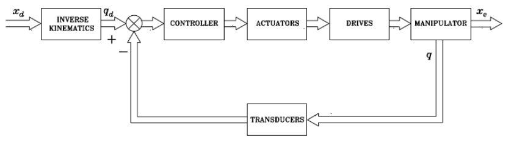 | 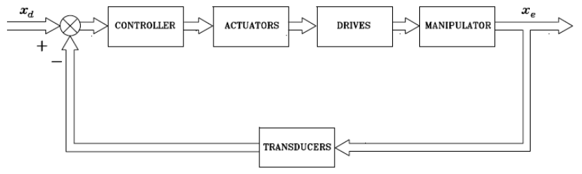 |

### Robots à entraînement direct

Les robots à entraînement direct, permettent, au travers de leurs moteurs à couple élevé, de supprimer les problématiques liées à l'efficacité mécanique telles que les frottements et le jeu. 
Cependant, les non-linéarités et les couplages entre les articulations exigent des stratégies de contrôle spécifiques, distinguant des robots tels que *SCARA* et *Staubli* du robot à entraînement direct *Adept*.

### Conclusion

Ces stratégies de contrôle nécessitent des mises en oeuvre distinctes en termes de matériel et de logiciel. 
De plus, comme c'est souvent le cas en contrôle, **l'amélioration des performances va de pair avec une augmentation de la "précision" de la modélisation et/ou de la complexité du schéma de contrôle requis.**

En résumé, le contrôle en boucle fermée des robots peut être envisagé à travers différentes stratégies, incluant 

* le contrôle en **espace articulaire**, 
* le contrôle en **espace opérationnel** (cartésien), 
* le contrôle en **contact avec l'environnement** : contrôle de rigidité, contrôle hybride force/position, contrôle hybride d'impédance
* le contrôle basé sur les **capteurs extéroceptifs** : contrôle basé sur la vision, contrôle basé sur le laser, etc.

### Liens avec la conception de trajectoire de référence

Les trajectoires de référence sont les points de consigne des régulateurs en boucle fermée.

Remarque : ces trajectoires sont des signaux au moins de classe $C^1$ (par exemple, pour un "profil de vitesse trapézoïdal", la trajectoire de position de référence obtenue est constituée d'un arc de parabole avec une courbure positive, suivi d'un segment de droite, suivi d'un autre arc de parabole avec une courbure négative). Les points de consigne en forme d'échelon n'auraient aucun sens. Cependant, il est important de noter que :

Lorsque des mouvements ponctuels sont considérés, l'objectif du contrôle en boucle fermée est de réguler la variable contrôlée vers une valeur de consigne constante (en fait, la valeur finale du signal de référence).

Lorsque des trajectoires opérationnelles continues sont envisagées, l'objectif du contrôle en boucle fermée est de faire suivre à la variable contrôlée le signal de référence.

Ces considérations soulignent l'importance des trajectoires de référence en tant que points de consigne pour les régulateurs en boucle fermée. En effet, les caractéristiques géométriques et dynamiques de ces trajectoires influent directement sur les performances du système robotique en termes de suivi de trajectoire et de régulation.

### Approche de Contrôle

| **Approche de Contrôle**                                | **Description**                                                                                                                                                                               |
|---------------------------------------------------------|-----------------------------------------------------------------------------------------------------------------------------------------------------------------------------------------------|
| **Contrôle décentralisé**                               | Un régulateur de rétroaction (linéaire) par axe, synthétisé indépendamment.   Structure simple (peu de communication entre les articulations), matériel peu coûteux, extensibilité (même formulation sur chaque articulation).   Convient principalement pour des mouvements ponctuels.            |
| **Contrôle de préalimentation (centralisé)**             | Un régulateur de rétroaction (décentralisé linéaire) par axe.   Un régulateur de préalimentation (centralisé non linéaire).   Plus complexe, car des calculs hors ligne de la dynamique du robot sont nécessaires.   Adapté pour un suivi de trajectoire "simple" sous certaines hypothèses.                                   |
| **Contrôle de rétroaction multivariable (centralisé)**   | Un régulateur de rétroaction (centralisé non linéaire), éventuellement incluant également la préalimentation.   Bien plus complexe, car des calculs en ligne de la dynamique du robot sont nécessaires.   Adapté pour le suivi de n'importe quelle trajectoire, sur n'importe quel robot, etc.                                   |

# CHAPITRE I OUTILS & MODÈLES

## Modélisation d'un moteur à aimant permanent

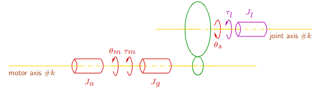 $\newline$*Figure : Schéma (pour chaque articulation k - chaque variable doit être subscriptée par k)*

Le schéma ci-dessus représente la modélisation d'un moteur à courant continu à aimant permanent pour chaque articulation (k). Chaque joint est caractérisé par des paramètres tels que :

* l'inertie de l'actionneur ($J_a$), 
* l'inertie du train d'engrenages ($J_g$),
* l'inertie de la charge ($J_l$). 

L'effort généralisé généré ($\tau_m$) est déterminé en fonction des variables de position, vitesse et accélération de l'articulation ($q, \dot{q}, \ddot{q}, \ldots$). L'effort généralisé sur l'axe secondaire ($\tau_l$) est également considéré, avec une relation non linéaire par rapport à différentes variables articulaires. L'effort équivalent est ensuite ramené sur l'axe primaire ($r\tau_l$).

La loi fondamentale de la dynamique est exprimée comme :

$$J_m \ddot{\theta}_m = -B_m \dot{\theta}_m + (\tau_m - r\tau_l)$$

* $J_m$ représente l'inertie totale du moteur, 
* $B_m$ le coefficient de friction du moteur,
* $r$ le rapport de réduction ramené sur l'axe primaire.

### Expressions des causes et des effets

L'effort généralisé ($\tau_m$) provoque le déplacement de l'articulation ($\theta_m$), tandis que ($\theta_s = q_k$). Cependant, ($\tau_l$) s'oppose à ($\tau_m$) via l'effort ($r\tau_l$) ramené sur l'axe primaire. 

Selon la loi fondamentale de la dynamique :

$$J_m \ddot{\theta}_m = -B_m \dot{\theta}_m + (\tau_m - r\tau_l)$$

* $J_m$ est l'inertie du moteur (c'est-à-dire l'inertie de l'actionneur et du réducteur)
* $B_m$ est le coefficient de friction du moteur (dû aux balais du moteur et au réducteur).

On peut alors écrire :

$$\frac{\Omega_m(s)}{\tau_m(s) - r\tau_l(s)}=\frac{1}{B_m + J_ms}$$

#### Qu'est-ce qui cause $\tau_m$ ?

Dans le contexte d'un moteur à courant continu, le courant $i_a\text{[A]}$ est généré lorsque la tension est appliquée à l'armature du moteur, provoquant le mouvement du rotor et la production de couple ($\tau_m\text{[Nm]}$​).

Dans le même contexte, la constante $K_m\text{[Nm/A]}$ est appelée la "constante de couple électromagnétique" ou "constante de couple du moteur". Celle-ci caractérise la relation entre le courant électrique ($i_a\text{[A]}$) traversant l'armature du moteur et le couple ($\tau_m\text{[Nm]}$) généré par le moteur. En résumé, elle quantifie la capacité d'un moteur à convertir le courant électrique en un couple mécanique.

Mathématiquement, la relation entre le couple et le courant peut être exprimée comme suit :

$$\tau_m\text{[Nm]} = K_m\text{[Nm/A]} \times i_a\text{[A]}$$

* $\tau_m\text{[Nm]}$ est le couple généré par le moteur,
* $K_m\text{[Nm/A]}$ est la constante de couple électromagnétique,
* $i_a\text{[A]}$ est le courant électrique dans l'armature (bobine) du moteur.

#### Effet du couple généré $\tau_m$ sur le mouvement angulaire du moteur $\theta_m$

C'est une conséquence des propriétés électromécaniques des moteurs à courant continu. Cette relation peut être expliquée comme suit :

1. **Génération de couple ($\tau_m$ par $i_a$):** Lorsqu'un courant électrique ($i_a$) circule dans l'armature du moteur, il crée un champ magnétique qui interagit avec le champ magnétique généré par les aimants permanents du moteur. Cette interaction engendre un couple électromagnétique ($\tau_m$) qui a tendance à faire tourner le rotor du moteur.

2. **Réponse mécanique ($\theta_m$ par $\tau_m$):** Le couple ($\tau_m$) appliqué au rotor entraîne un mouvement angulaire ($\theta_m$) du moteur. Ce mouvement est lié à l'inertie du système mécanique.

3. **Contre-fem ($v_b$ par $\dot{\theta}_m$):** Lorsque le rotor du moteur tourne, il coupe les lignes de flux magnétique et génère une tension appelée contre-fem ($v_b$). Cette contre-fem agit contre la tension d'alimentation ($v$). La relation mathématique qui lie la contre-fem ($v_b$) à la vitesse angulaire ($\dot{\theta}_m$) est donnée par $v_b = K_b \dot{\theta}_m$, où $K_b$ est la constante de contre-fem.

En d'autres termes, plus la vitesse angulaire du moteur ($\dot{\theta}_m$) est élevée, plus la contre-fem ($v_b$) générée est grande. La contre-fem s'oppose à la tension d'alimentation $v$ et modifie la réponse électrique du système.

#### Effet de $v - v_b$ sur $i_a$ selon les lois des circuits de Kirchhoff

Les Lois de Kirchhoff énoncent les principes fondamentaux de la conservation de l'énergie électrique dans un circuit électrique. L'équation donnée si-dessous fait référence à l'équation de tension dans un circuit.

$$L \frac{di_a}{dt} + Ri_a = v - v_b \Rightarrow  \frac{I_a(s)}{V(s) - V_b(s)}=\frac{1}{R + Ls}$$

Cette équation exprime la relation entre la tension d'alimentation $v$, la contre-fem $v_b$, le courant d'armature $i_a$, et les paramètres électriques du moteur et sa forme après transformation de Laplace. Plus précisement :

   * $L \frac{di_a}{dt}$ représente la tension induite par l'auto-inductance ($L$) de l'armature du moteur, liée au taux de variation du courant ($i_a$).
   * $Ri_a$ représente la chute de tension due à la résistance ($R$) de l'armature.
   * $v$ est la tension d'alimentation appliquée à l'armature.
   * $v_b$ est la contre-fem générée par le mouvement du rotor du moteur.
   * $I_a(s)$ est la transformée de Laplace du courant d'armature ($i_a$).
   * $V(s)$ est la transformée de Laplace de la tension d'alimentation ($v$).
   * $V_b(s)$ est la transformée de Laplace de la contre-fem ($v_b$).
   * $R + Ls$ est la transformée de Laplace de la résistance et de l'inductance dans le domaine de Laplace.

### Premières conclusions

On peut ainsi exprimer le modèle de transfert pour chaque articulation $k$ d'un moteur à courant continu, en utilisant la transformée de Laplace. Les fonctions de transfert $F_{\theta_m v}(s)$ et $F_{\theta_m \tau_l}(s)$ capturent les caractéristiques dynamiques du système électromécanique.

$$(1) : \Theta_m(s) = F_{\theta_m v}(s)V(s) + F_{\theta_m \tau_l}(s)\tau_l(s)$$
$$(2) : F_{\theta_m v}(s) = \frac{K_m}{s(K_b K_m + (R + Ls)(B_m + J_ms))}$$
$$(3) : F_{\theta_m \tau_l}(s) = \frac{-r(R + Ls)}{s(K_b K_m + (R + Ls)(B_m + J_ms))}$$

1. **Expression Générale:**

   * $\Theta_m(s)$ transformée de Laplace du mouvement angulaire ($\theta_m$) de l'articulation $k$. En d'autres termes, c'est la **réponse du système**.
   * $V(s)$ transformée de Laplace de la tension d'alimentation appliquée au moteur. Cette tension peut être contrôlée par un système de commande pour influencer le mouvement du moteur.
   * $\tau_l(s)$ transformée de Laplace de l'effort généralisé sur l'axe secondaire ($\tau_l$) de l'articulation $k$. Cet effort peut être dû à des forces externes appliquées au système, des interactions avec l'environnement, ou d'autres sources.

2. **Fonction de Transfert $F_{\theta_m v}(s)$:**

   * $F_{\theta_m v}(s)$ représente la fonction de transfert entre la tension d'alimentation ($V(s)$) et le mouvement angulaire ($\Theta_m(s)$). Plus précisément, c'est la fonction de transfert qui caractérise comment la tension appliquée influence le mouvement angulaire de l'articulation. Elle est déterminée par les **propriétés électromécaniques** du moteur.
   * $K_m$ constante de couple électromagnétique.
   * $K_b$ constante de contre-fem.
   * $R$ résistance de l'armature.
   * $L$ inductance de l'armature.
   * $B_m$ inertie du train d'engrenages.
   * $J_m$ inertie totale du moteur (actionneur + réducteur).

3. **Fonction de Transfert $F_{\theta_m \tau_l}(s)$ :**

   * $F_{\theta_m \tau_l}(s)$ représente la fonction de transfert entre l'effort généralisé sur l'axe secondaire ($\tau_l(s)$) et le mouvement angulaire ($\Theta_m(s)$). C'est une fonction de transfert qui caractérise comment l'effort généralisé sur l'axe secondaire influence le mouvement angulaire de l'articulation. Cette contribution est liée aux **caractéristiques mécaniques** du système.
   * $r$ rapport de réduction entre l'axe secondaire et l'axe primaire.
   * $R$ résistance de l'armature.
   * $L$ inductance de l'armature.
   * $B_m$ inertie du train d'engrenages.
   * $J_m$ inertie totale du moteur (actionneur + réducteur).

### Simplifications du modèle
- Si les effets de l'inductance et de l'inertie sont négligeables par rapport à la résistance et à la friction ($\frac{L}{R} << \frac{J_m}{B_m}$), le modèle se simplifie en :

$$\Theta_m(s) = \frac{K_m}{R} \frac{1}{s(Beff + J_ms)}V(s) - \frac{1}{s(Beff + J_ms)} r\tau_l(s)$$
$$Beff = B_m + \frac{K_b K_m}{R}$$

* $Beff$ coefficient de friction effectif qui prend en compte la friction ($B_m$) ainsi que les effets de la contre-fem générée ($\frac{K_b K_m}{R}$).
* $\frac{K_m}{R} \frac{1}{s(Beff + J_ms)}V(s)$ dynamique électromécanique du moteur
* $- \frac{1}{s(Beff + J_ms)} r\tau_l(s)$ caractéristiques mécaniques et de friction

**Remarques**

Parfois, la structure du modèle ci-dessus est conservée pour (chaque axe de) l'ensemble du robot (y compris ses actionneurs), à condition que pour chaque k, $J_m$ et $\tau_l$ soient remplacés par l'"inertie effective" $J_{eff}$ et une perturbation $d_k$ constante lorsque le robot est au repos. La contribution de $B_m$ dans $Beff$ est parfois négligée.

## Introduction aux modèles dynamiques des robots manipulateurs rigides

* **Dynamique Directe :** À partir de la connaissance de $\tau(t)$, déduire l'évolution temporelle de $q(t)$.
* **Dynamique Inverse :** À partir de la connaissance de $q(t)$, $\dot{q}(t)$, $\ddot{q}(t)$, déduire $\tau$.

**Expression**
$$D(q) \ddot{q} + C(q, \dot{q}) \dot{q} + g(q) = \tau$$

* $D(q)$ est la matrice d'inertie du robot ; $D(q) = D^T(q) > 0$
* $C(q, \dot{q})$ est la matrice des efforts centrifuges et de Coriolis ; $\dot{D}(q) - 2C(q, \dot{q})$ est antisymétrique.
* $g(q)$ est le vecteur lié à la gravitation.
* $\tau$ est le vecteur des efforts généralisés appliqués sur les articulations du robot.

**Remarque :** Peut être difficile à déterminer expérimentalement, surtout pour un robot avec des liens non polyédriques ou non ellipsoïdaux...

## Contrôle proportionnel dérivé (PD)

La contrôle PD vise à minimiser l'écart entre la position angulaire de référence et la position angulaire réelle, ainsi que la vitesse angulaire réelle. Les termes proportionnel ($K_p$) et dérivatif ($K_d$) permettent de réguler la position et la vitesse, respectivement. Importance des gains $K_p$ et $K_d$ dans la stabilité du système de contrôle.

**Loi de Contrôle pour Chaque Articulation $k$ :**

$$V(s) = K_p (\Theta^\star(s) - \Theta(s)) - K_d s \Theta(s) \Longleftrightarrow v(t) = K_p (\theta^\star(t) - \theta(t)) - K_d \dot{\theta}(t)$$

* $V(s)$ est la transformée de Laplace de la tension d'alimentation appliquée à l'articulation $k$.
* $K_p$ est le **gain proportionnel**.
* $K_d$ est le **gain dérivatif**.
* $\Theta^\star(s)$ est la transformée de Laplace de la position angulaire de référence ($\theta^\star(t)$).
* $\Theta(s)$ est la transformée de Laplace de la position angulaire réelle ($\theta(t)$).
* $v(t)$ est la tension d'alimentation réelle appliquée à l'articulation $k$.
* $\theta(t)$ est la position angulaire réelle de l'articulation $k$.
* $\dot{\theta}(t)$ est la dérivée temporelle de la position angulaire réelle.

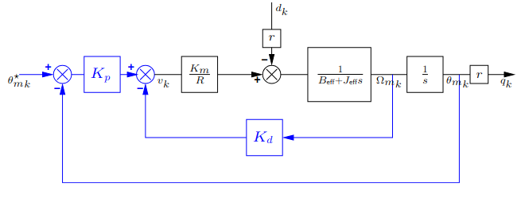

### Rappel Concis sur le Contrôle PD et la Rétroaction Tachymétrique (Vitesse)

| **Diagramme de Bode de $DPD(s) = k(1 + T_ds)$** | **Directives Générales pour la Sélection de $k, T_d$** |
| ----------------------------------------------- | ------------------------------------------------ |
| Représente la réponse fréquentielle du système de contrôle PD avec rétroaction tachymétrique. | Augmenter les marges de stabilité du système de rétroaction en ajoutant une phase positive à la réponse en fréquence de la fonction de transfert en boucle ouverte près du point critique. |
| 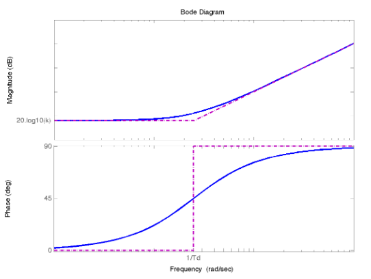                                | 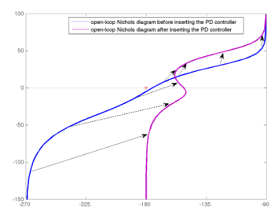                                   |

**Problèmes Potentiels liés au Bruit :** Dans le cas du contrôle PD, il peut y avoir des problèmes liés au bruit. Pour atténuer cela, on peut introduire un terme de déphasage (phase-lead) $DPhLead(s) = DPD(s)/(1+\tau s)$.

**Pourquoi la Rétroaction Tachymétrique est Préférée au Contrôle PD ? :**

| Correcteur Tachymétrique                          | Correcteur PD                                |
| ------------------------------------------------------------ | ------------------------------------------------------ |
| 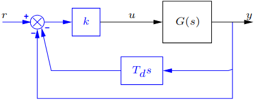                                        | 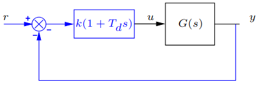                                     |

| **Argument Pratique :**| **Explication Théorique :**|
| -------------------------- | ----------------------------- |
| - Quel que soit le schéma de contrôle, le signal de contrôle $u$ implique la dérivée de la sortie $y$, avec $y$ un signal "lisse". | - Les fonctions de transfert en boucle fermée $FTACHO(s)$ et $FPD(s)$ sont telles que $FPD(s) = FTACHO(s)(1 + T_ds)$. |
| - Dans le contrôle PD, la dérivée de la référence $r$ (qui peut être un échelon, par exemple) est également impliquée dans $u$, ce qui n'est pas le cas pour la rétroaction tachymétrique. | - Les effets indésirables dans la réponse transitoire de $y$ proviennent du zéro en $-1/T_d$ dans la fonction de transfert $FPD(s)$. |

### Application au Problème de la Robotique

$$\Theta(s) = \frac{K_p\frac{K_m}{R}\Theta^\star(s) - rd(s)}{J_{eff}s^2 + (B_{eff} + K_d \frac{K_m}{R})s + K_p \frac{K_m}{R}}$$

* **Critère de Routh :**
   * Le système de rétroaction est stable si et seulement si les coefficients du dénominateur de l'expression ci*dessus sont tous positifs.
   * Cette condition nécessaire de stabilité est également suffisante ici.
   * Remarque : Le dénominateur commun aux transferts de toute entrée externe ($\theta^*$ ou $d$) à la variable contrôlée $\theta$ est notable.

* **Ajustement des Paramètres du Contrôleur $K_p, K_d$ :**
   * Polynôme caractéristique du 2e ordre : $K_p, K_d$ sont sélectionnés de manière à ce que le système de rétroaction soit stable, avec un rapport d'amortissement unitaire ($\zeta_{\text{boucle fermée}} = 1$).
   * Temps de stabilisation minimum sans dépassement.

   * Effet qualitatif de $K_p, K_d$ sur la position des pôles en boucle fermée (locus de racines d'Evans).

    

    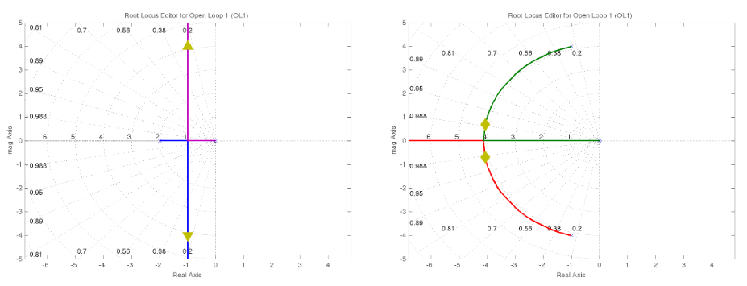 $\newline$ *Figure : Effet de $K_p$ pour $K_d = 0$  (à gauche) et effet de $K_d$ pour $K_p$ fixé (à droite)*

    

* **Précision du Système de Rétroaction :**
   * Si $d_k$ est une perturbation constante, l'erreur de position $lim_{t\rightarrow+\infty}\varepsilon(t)$ pour une référence constante $\theta^*(t) = \theta^*_0$ atteint une valeur constante $\varepsilon_{pos}$, qui diminue à mesure que $K_p$ augmente. Pour $d_k=d_0\Gamma(t)$ :
    $$\varepsilon_{pos} = \frac{rd_0}{K_p \frac{K_m}{R}}$$

   * De même, l'erreur de vitesse $ε_{vel}$ pour $\theta^*(t) = \dot{\theta}_1 t\Gamma(t)$ et $d_k = d_0\Gamma(t)$ est donnée par :
$$\varepsilon_{vel} = \frac{\left(K_d \frac{K_m}{R} + B_{eff}\right) \dot{\theta}_1 + rd_0}{K_p \frac{K_m}{R}}$$

* **Limites :**
   * Saturation des actionneurs (attention à la valeur du dépassement !)
   * Cette méthode peut/doit être étendue pour traiter la flexibilité dans le système d'entraînement, le cas échéant.

## Controle Proportionnel Intégral Dérivé (PID)

La loi de contrôle PID est une extension du contrôle PD qui ajoute un terme intégral pour éliminer les erreurs en régime permanent. Les termes proportionnel ($K_p$), intégral ($K_i$), et dérivatif ($K_d$) permettent de réguler la position, l'intégrale de l'erreur, et la vitesse, respectivement. Le terme intégral est particulièrement efficace pour éliminer les erreurs en régime permanent, tandis que le terme dérivatif contribue à la stabilité du système en réduisant le dépassement.

### Loi de Contrôle pour Chaque Articulation $k$

$$V(s) = K_p (\Theta^\star(s) - \Theta(s)) +  \frac{K_i}{s} (\Theta^\star(s) - \Theta(s)) \, d\tau - K_d s \Theta(s)$$ 
$$\Longleftrightarrow v(t) = K_p (\theta^\star(t) - \theta(t)) + K_i \int_{-\infty}^{t} (\theta^\star(\tau) - \theta(\tau)) \, d\tau - K_d \dot{\theta}(t)$$

- $V(s)$ est la transformée de Laplace de la tension d'alimentation appliquée à l'articulation $k$.
- $K_p$ est le gain proportionnel.
- $K_i$ est le gain intégral.
- $K_d$ est le gain dérivatif.
- $\Theta^\star(s)$ est la transformée de Laplace de la position angulaire de référence ($\theta^\star(t)$).
- $\Theta(s)$ est la transformée de Laplace de la position angulaire réelle ($\theta(t)$).
- $v(t)$ est la tension d'alimentation réelle appliquée à l'articulation $k$.
- $\theta(t)$ est la position angulaire réelle de l'articulation $k$.
- $\dot{\theta}(t)$ est la dérivée temporelle de la position angulaire réelle.

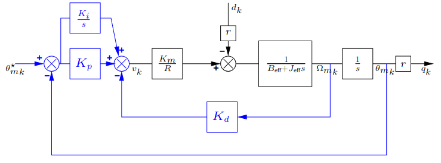 $\newline$ *Figure : Implémentation du contrôle PID sur une articulation*

### Rappel Concis sur le Contrôle Proportionnel Intégral (PI)

* **Diagramme de Bode de $D(s) = \frac{k}{T_i s}(1 + T_i s)$ :** Le diagramme de Bode représente la réponse fréquentielle du système de contrôle PI.

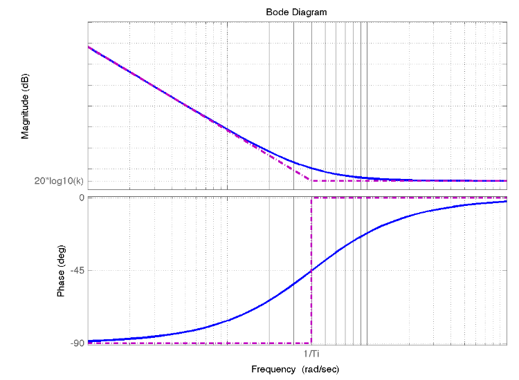 $\newline$ *Figure : Diagramme de Bode*

* **Effet et Ajustement du Contrôle PI :**
   *  Supprime l'erreur de régime permanent non nulle du "type le plus élevé".
   * $\frac{1}{T_i}$ doit être suffisamment bas pour que la réponse en fréquence en boucle ouverte ne soit pas modifiée à proximité du point critique.
   * Une méthode d'ajustement célèbre : la règle symétrique optimale.
   * Attention aux saturations des actionneurs ! Des systèmes anti-saturation existent pour prévenir l'instabilité induite.

### Contrôle Proportionnel Intégral Dérivatif (PID)
La plupart des régulateurs industriels utilisent le contrôle PID en raison de sa relative simplicité, de la connaissance experte et de la robustesse obtenue, y compris dans servomoteurs.

* **Trois Configurations de Base du PID :**
   * Standard : $D(s) = k(1 + \frac{1}{T_i}s + T_d s)$
   * Parallèle : $D(s) = K_p + \frac{K_i}{s} + K_d s$
   * Série : $D(s) = \frac{k'}{T'_i s}(1 + T'_i s)(1 + T'_d s)$ (remarquer qu'elles ne sont pas équivalentes, car la forme série suppose des zéros réels).

* **Diagramme de Bode d'une Forme Série :**
   * Attention aux erreurs potentielles dans les tracés manuels du diagramme de Bode des configurations PID standard et parallèle !

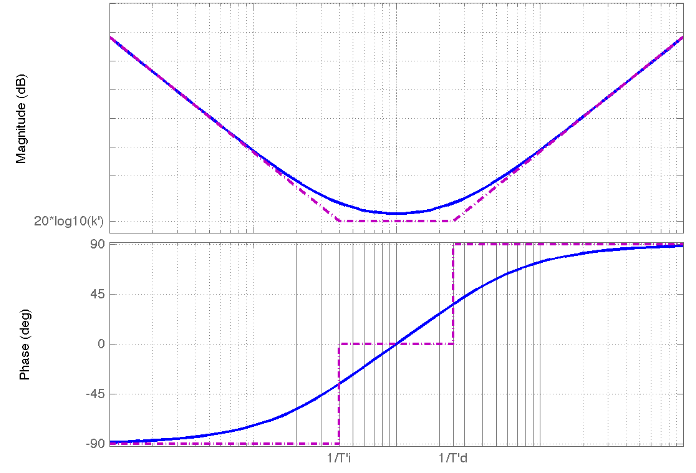 $\newline$ *Figure : Diagramme de Bode*

### Méthodes d'Ajustement
   * Analytiques, basées sur la fréquence, empiriques.
   * Avantages et inconvénients du PD et du PI (cf. systèmes anti-saturation...).
   * Voir aussi *"PID controllers: Theory, Design and Tuning" - K.J.  ̊Astrom, T. Hagglund, Instrument Society of America, 1995*.

### Application au Contrôle Indépendant de l'Espace Articulaire en Robotique
   * Dès que le système de rétroaction est stable, l'erreur de position en régime permanent est éliminée.
   * Rappel : l'action PD est généralement mise en œuvre comme une rétroaction de vitesse.
   * Encore une fois, attention aux saturations des actionneurs, et utilisez des systèmes anti-saturation pour prévenir l'instabilité induite.

## Contrôle Feed-Forward

Le contrôle feedforward, dans le contexte du contrôle de systèmes dynamiques tels que les robots, vise à anticiper et à compenser les effets indésirables avant même qu'ils n'affectent le système. Contrairement au contrôle en boucle fermée qui ajuste le système en réponse aux erreurs constatées, le contrôle feedforward agit en amont pour prévoir et annuler les perturbations avant qu'elles n'affectent le système.

Prenons un exemple pratique pour mieux comprendre le concept du contrôle feedforward :

Supposons que vous contrôlez la position d'un bras robotique qui doit se déplacer d'un point A à un point B. Dans un scénario de contrôle en boucle fermée classique, le contrôleur détecte l'erreur entre la position réelle du bras et la position souhaitée, puis ajuste les commandes pour corriger cette erreur.

Maintenant, avec l'ajout du contrôle feedforward, le système prend également en compte les perturbations potentielles qui peuvent affecter le déplacement du bras robotique. Ces perturbations pourraient être des forces externes, des frictions, des variations de charge, etc.

Le contrôle feedforward utilise un modèle prédictif du système pour estimer comment ces perturbations pourraient influencer le déplacement du bras. Ensuite, il génère des commandes anticipatives pour compenser ces effets avant même qu'ils ne se produisent.

Soit l'exemple suivant :

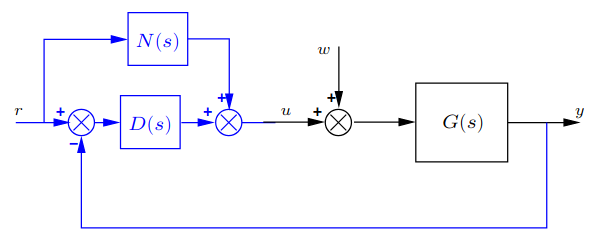 $\newline$ *Figure : Exemple*

Décrit par l'équation de transfert : 

$$Y(s) = \frac{(N(s)G(s) + D(s)G(s))R(s) + G(s)W(s)}{1 + D(s)G(s)}$$

la partie $N(s)G(s)R(s)$ représente le terme feedforward. Il contribue à la sortie en ajoutant la commande anticipée basée sur la référence $R(s)$ avant même que le contrôle en boucle fermée ne compense les erreurs.

En résumé, le contrôle feedforward permet d'anticiper et de compenser activement les perturbations, améliorant ainsi la réactivité et la performance globale du système.

### Condition de suivi parfait

1. **Suivi Parfait :**
   * **Absence de Perturbation (w=0) :** Lorsqu'il n'y a pas de perturbation (w=0), le système est soumis uniquement à la référence $R(s)$. Si la fonction de transfert $N(s)G(s)$ est égale à 1, alors la sortie $Y(s)$ est exactement égale à l'entrée de référence $R(s)$, ce qui indique un suivi parfait. En d'autres termes, le contrôleur, à travers $N(s)$, ajoute en boucle ouverte les éléments nécessaires pour atteindre un suivi sans erreur.
2. **Contraintes :**
   * **Stabilité de $N(s)$ :** Pour garantir la stabilité du système, la fonction de transfert $N(s)$ doit être stable. Cela impose que la fonction de transfert $G(s)$ soit de phase minimale, car $N(s) = G(s)^{-1}$.
   * **Causalité de $N(s)$ :** La causalité de $N(s)$ peut être assurée en dérivant l'entrée de référence $r(t)$ autant de fois que nécessaire. Cela signifie que la construction de $N(s)$ doit tenir compte des dérivées temporelles de l'entrée de référence, garantissant ainsi une réponse causale.
3. **Illustration Pratique : Contrôle PD avec Feedforward**
   

   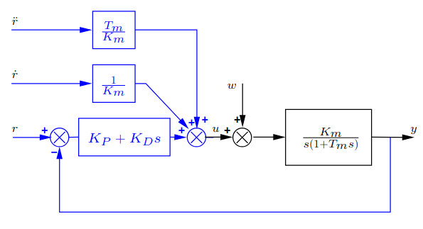 $\newline$ *Figure : Contrôle PD avec Feedforward*

   

   * **Schéma du Contrôle :**
      * La figure "Contrôle PD avec Feedforward" représente le schéma de contrôle, où $R(s)$ est la référence, $W(s)$ est la perturbation, $Y(s)$ est la sortie, et $N(s)G(s)$ est la fonction de transfert du contrôle feedforward.
      * Le contrôle PD traditionnel est également présent dans le schéma, avec $K_p$ pour la proportionnelle et $K_d$ pour la dérivée.
      * L'élément clé ici est $N(s)$, la fonction de transfert du contrôle feedforward, qui est ajoutée en boucle ouverte pour anticiper et compenser les perturbations.
   * **Objectif du Contrôle Feedforward :**
      * L'objectif de l'ajout de $N(s)$ en boucle ouverte est d'anticiper et de compenser les effets de la perturbation $W(s)$ avant même qu'ils n'affectent la sortie $Y(s)$.
      * En d'autres termes, le contrôle feedforward contribue à annihiler les effets de la perturbation, ce qui améliore la capacité du système à suivre la référence $R(s)$ sans erreur.
   * **Conditions pour un Suivi Parfait :**
      * Pour atteindre un suivi parfait, la condition $N(s)G(s) = 1$ doit être satisfaite, comme expliqué précédemment. Cela garantit que, en l'absence de perturbation, la sortie est exactement égale à la référence.
   * **Contraintes et Causalité :**
      * La stabilité de $N(s)$ est cruciale pour assurer la stabilité globale du système.
      * La causalité de $N(s)$ peut être assurée en considérant les dérivées temporelles nécessaires de l'entrée de référence $r(t)$.
   * **Avantages :**
      * L'ajout de $N(s)$ permet d'anticiper les perturbations et d'améliorer la capacité du système à maintenir un suivi précis de la référence, même en présence de perturbations.
      * Le contrôle feedforward améliore la performance globale du système en agissant préventivement sur les perturbations.

En résumé, l'illustration pratique du contrôle PD avec feedforward met en évidence comment cette approche spécifique contribue à atteindre un suivi parfait en anticipant et en compensant les perturbations, améliorant ainsi la robustesse et la précision du système de contrôle.

**Remarque :** Le redessin du schéma de contrôle en boucle fermée, incluant le feedforward, permet de visualiser plus clairement le rôle de chaque composant.

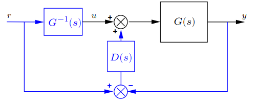 $\newline$ *Figure : Contrôle en boucle fermée + feedforward*

**Question :** Comment le contrôle feedforward et le contrôle en boucle fermée permettent-ils d'annihiler une perturbation?

La clé de l'efficacité réside dans la synergie entre le contrôle feedforward et le contrôle en boucle fermée. Le contrôle feedforward agit préventivement en fournissant une action de commande anticipée, tandis que le contrôle en boucle fermée ajuste continuellement la commande en fonction des informations en temps réel sur la sortie du système. Ensemble, ces deux approches visent à minimiser les erreurs causées par la perturbation et à maintenir le système aussi proche que possible de la trajectoire désirée. Il est à noter que la robustesse de cette stratégie dépend de la précision du modèle du système et de la capacité du contrôle feedforward à prédire et compenser correctement la perturbation.

## Commande en Vitesse vs Commande en Couple

Reconsidérons le schéma bloc du moteur à courant continu si dessous, avec L négligé. 

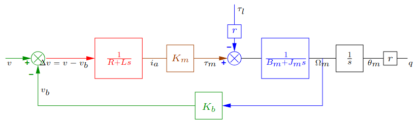 $\newline$ *Figure : Schéma bloc du moteur à courant continu*

Pour des raisons d'exhaustivité, ce schéma peut être complété en insérant :

* une fonction de transfert $$F_{vv_0}(s) = \frac{V(s)}{V_0(s)} = \frac{K_0}{1 + T_0s}$$ représentant la relation entrée-sortie de l'amplificateur de puissance (gain élevé $K_0$, $T_0 \in [10^{-5}, 10^{-4}]s$),
* une rétroaction de courant interne, définie par $$V_0(s) = C_i(s)(V_{in}(s) - k_iI_a(s))$$, avec $V_{in}$ le signal de référence externe.

Par conséquent, pour $\tau_l = 0$,

* si $k_i = 0$ et $C_i(0) = 1$, alors $\omega_m \propto K_0V_{in}$ en régime permanent, et le système d'entraînement est qualifié de commandé en vitesse.
* si $k_i$ est élevé, alors $\tau_m \propto \frac{1}{k_i}(V_{in} - \frac{K_b}{K_0}\omega_m)$, de sorte que $\tau_m \propto \frac{1}{k_i}V_{in}$ compte tenu de la valeur élevée de $K_0$, et le système d'entraînement est qualifié de commandé en couple.

De plus, pour un entraînement commandé en vitesse, une perturbation non nulle $\tau_l$ est rejetée avec un gain plus faible et une réponse temporelle plus rapide que dans le cas où l'entraînement est commandé en couple. 

Ainsi, 

* Les entraînements **commandés en vitesse** seront utilisés lorsque le rejet élevé des perturbations est nécessaire (par exemple, **commande indépendante décentralisée** des articulations). 
* Les entraînements **commandés en couple** seront mieux adaptés aux schémas de **commande centralisée**.

# Contôle en espace articulaire

## Modèles complets pour le contrôle en espace articulaire

### Modèle selon Lewis/Spong (d'autres options existent !)

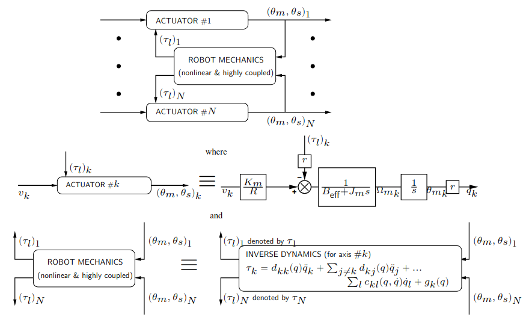 $\newline$ *Figure : Modèle de Lewis/Spong*

À ce stade, quelles sont les difficultés rencontrées et que peut-on faire pour synthétiser une loi de commande en boucle fermée "simple" ?

Comme mentionné précédemment, les efforts généralisés $(r\tau_l)_k$ renvoyés sur chaque articulation $k$ sont des fonctions non linéaires couplées de la configuration/velocités/accélérations $q/\dot{q}/\ddot{q}$ du robot (plus de détails à ce sujet plus tard...).
Ainsi, $(r\tau_l)_k$ peut être considéré comme une simple perturbation sous des hypothèses très spécifiques.

Remarque : l'ensemble du système peut être modélisé comme
$$D_0(q) \ddot{q} + C_0(q, \dot{q}) \dot{q} + g_0(q) = u, \quad \text{avec}$$
$$D_0(q) = D(q) + \text{diag}(\{\frac{J_m}{r^2}\}_k),$$
$$C_0(q, \dot{q}) = C(q, \dot{q}) + \text{diag}(\{\frac{B_{eff}}{r^2}\}_k),$$
$$u = \text{diag}(\{\frac{\frac{K_m}{R}}{r}\}_k) v, \quad \text{où} \quad v = (v_1, \ldots, v_N).$$

### Modèle selon Siciliano et al.

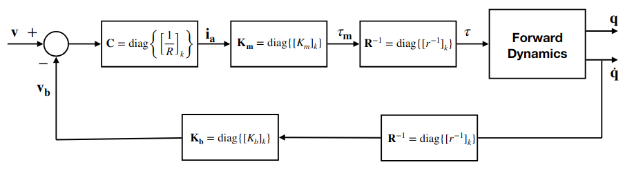 $\newline$ *Figure : Modèle de Siciliano et al.*

$$\tau = R^{-1}K_m C(v - KbR^{-1}\dot{q})$$
$$\tau = D(q) \ddot{q} + C(q, \dot{q}) \dot{q} + g(q)$$
$$D(q) \ddot{q} + (C(q, \dot{q}) + K_mK_bCR^{-2})\dot{q} + g(q) = K_mCR^{-1}v$$

Plutôt adapté à une commande centralisée, mais l'approche de commande décentralisée présentée par la suite peut être directement étendue à ce modèle.

## Commande Décentralisée

### Objectifs

1. **Concevoir un régulateur de rétroaction sur chaque axe indépendamment des autres axes :** L'idée fondamentale est de développer des contrôleurs distincts pour chaque articulation du robot, de manière à ce que le mouvement de chaque axe puisse être régulé de manière autonome, sans tenir compte des influences des autres articulations. Cela permet une approche modulaire, où le contrôle de chaque axe est traité de manière isolée, simplifiant ainsi la conception et l'implémentation du contrôle.

2. **Travailler sur des modèles simplifiés (linéaires) :** Les modèles de robots peuvent être complexes en raison des couplages non linéaires entre les articulations et des interactions dynamiques. L'objectif est de simplifier ces modèles pour les rendre linéaires. L'approximation linéaire permet de traiter le système de manière plus analytique, facilitant la conception et l'ajustement des contrôleurs. La linéarisation peut être réalisée autour d'un point de fonctionnement ou pour des mouvements petits, ce qui est souvent valide pour de nombreuses tâches robotiques.

3. **Implémenter des lois de commande simplifiées (linéaires) : PD, PID :** Utilisation de lois de commande proportionnelles-dérivées (PD) et proportionnelles-intégrales-dérivées (PID) en tant que méthodes de régulation. Ces lois de commande sont des approches classiques mais puissantes pour stabiliser et réguler les systèmes dynamiques. Le choix de PD ou PID dépend des spécifications de performance et des caractéristiques du système.

En résumé, la commande décentralisée cherche à simplifier la complexité inhérente des robots manipulateurs en traitant chaque axe de manière indépendante, en utilisant des modèles linéaires et des lois de commande classiques pour réguler le mouvement de chaque articulation. Cela simplifie la conception et la mise en oeuvre des contrôleurs, tout en conservant des performances acceptables pour de nombreuses applications robotiques.

### Comment ? 
Approximer le modèle complet non linéaire couplé ($♢$) du robot à N articulations et de ses actionneurs ci-dessous par $N$ modèles indépendants $(♠)k, k = 1,...,N$.

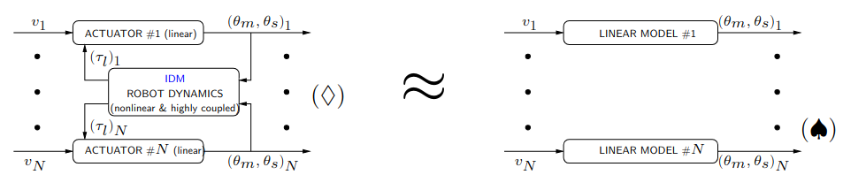 $\newline$ *Figure : Contôle décentralisé*

Un schéma diagrammatique a été introduit pour chaque actionneur $k$, où $r\tau_k$ représente l'effort généralisé $(r\tau_l)_k$ renvoyé par la dynamique du robot.

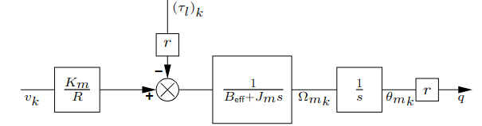 $\newline$ *Figure : Contôle décentralisé*

Nous allons échanger le modèle complet ($♢$) par N diagrammes linéaires parallèles (non interactifs) $(♠)_k$, où chacun s'écrit comme suit (pour chaque articulation $k$ - chaque variable doit être en indice $k$) :

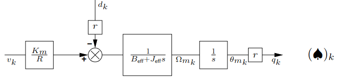 $\newline$ *Figure : Contôle décentralisé*

Les données du modèle dynamique inverse du robot nous permettent d'exprimer $J_{\text{eff}}$ et $d_k$ pour chaque axe $k$, en combinant les deux équations suivantes :
$$\tau_k = d_kk(q)\ddot{q}_k + \sum_{j \neq k} d_kj(q)\ddot{q}_j + \sum_l c_{kl}(q, \dot{q})\dot{q}_l + g_k(q)$$

$$J_m\ddot{\theta}_{m_k} + B_{\text{eff}}\dot{\theta}_{m_k} = \frac{K_m}{R}v_k - r\tau_k$$

Après quelques calculs, on obtient :

$$(J_m + r^2d_{kk}(q))\ddot{\theta}_{m_k} + B_{\text{eff}}\dot{\theta}_{m_k} = \frac{K_m}{R}v_k - rd_k(q, \dot{q}, \ddot{q})$$

Ainsi, chaque $(♠)_k$ peut être obtenu dès que :

* la constante $J_{\text{eff}}$ est fixée à la valeur constante, à la valeur moyenne ou à la valeur pire des cas de $J_m + r^2d_{kk}(q)$
* la dépendance de $d_k(q, \dot{q}, \ddot{q})$ en $q, \dot{q}, \ddot{q}$ est délibérément perdue, de sorte que $d_k(q, \dot{q}, \ddot{q})$ est remplacé par un signal de perturbation (exogène) $d_k(t)$ qui est supposé constant lorsque le robot ne bouge pas (en raison de la gravité).

### Qu'avons-nous fait ?

* Pour chaque indice d'articulation $k$, $(\tau_l)_k$ a été écrit comme la somme de deux contributions, dont l'une peut (dans une première approximation) être considérée comme un vrai signal exogène, par exemple $(\tau_l)_k$ peut être divisé en :
   * les efforts inertiels dus au corps qui suit immédiatement l'articulation $k$ : $(J_m)_k \rightarrow \text{"inertie effective"} (J_{\text{eff}})_k$
   * les efforts inertiels dus aux autres maillons, plus les autres efforts (centrifuges, gravitationnels, Coriolis, etc.) : $(\tau_l)_k \rightarrow (d)_k$
* Notez que de nombreuses autres façons d'obtenir un modèle simplifié en boucle ouverte pourraient être envisagées !

### Contrôleurs

* **Contrôle PD**
   * Peut stabiliser le système de rétroaction.
   * Erreur de position non nulle due à $d_k$ constant en régime permanent.
* **Contrôle PID**
   * Peut stabiliser le système de rétroaction.
   * Erreur de position nulle malgré $d_k$ asymptotiquement constant.

### Validité de l'approximation

* Tâches de point à point.
* Mouvements lents.
* Robots équipés d'un réducteur important, sans flexibilité dans les articulations.
* À noter cependant les effets potentiels non linéaires tels que le frottement, le jeu, etc.

## Commande Feedforward Centralisée
*Centralized Feedforward Control*

### Objectifs

* Suivre des signaux de référence variant dans le temps
* Tenir compte de la nature de $d_k(q, \dot{q}, \ddot{q})$

### Méthode de Calcul du Couple d'Avance Computationnelle

La méthode de calcul du couple d'avance computationnelle consiste à ajouter un signal feedforward $\xi_k$ à la sortie du régulateur en boucle fermée dédié à chaque axe $k$. Ce signal est calculé en boucle ouverte, et il se compose de deux parties ($\xi_1$ et $\xi_2$), dont $\xi_2$ est le plus crucial ici. 

Le calcul de $(\xi_2)_k$ prend en considération la nature de la perturbation dynamique $d_k(q, \dot{q}, \ddot{q})$ et est défini comme :

$$(\xi_2)_k = \frac{1}{K_m R} r \left\{ \sum_{j \neq k} d_k^j(q^\star) \ddot{q}^\star_j + \sum_l c_k^l(q^\star, \dot{q}^\star) \dot{q}^\star_l + g_k(q^\star) \right\}$$

La raison de cette définition de $(\xi_2)_k$ provient du fait que $q_k = r\theta_{mk}$ est supposé être proche de $q^\star_k = r\theta^\star_{mk}$ pendant la tâche...

### Diagramme Schématique

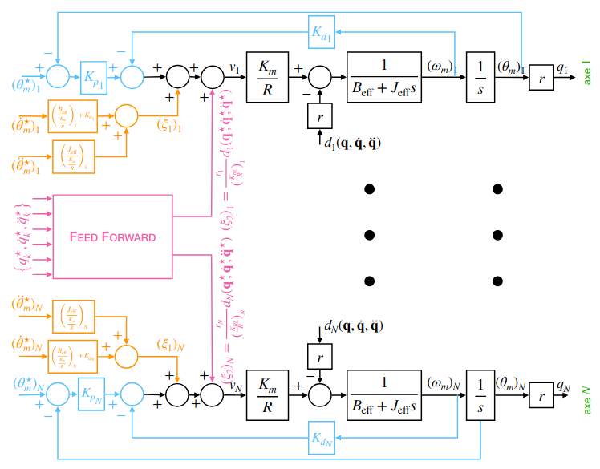 $\newline$ *Figure : Schéma bloc de la commande Feedforward Centralisée*

### Avantages, Inconvénients et Contraintes en Temps Réel

**Avantages :**

- La stabilité de l'ensemble du système en boucle fermée reste inchangée.
- Les performances globales du système, notamment en termes de suivi de référence, sont améliorées.

**Inconvénients :**

- Bien que $(\xi_2)_k$ ne soit pas équivalent à $r \cdot d_k(q, \dot{q}, \ddot{q})$, cette approche conduit à de bons résultats malgré cela.

**Contraintes en Temps Réel :**

La méthode nécessite des calculs hors ligne de $q^\star, \dot{q}^\star, \ddot{q}^\star$, qui sont ensuite stockés dans une table de recherche. Cela pourrait poser des contraintes en temps réel, en particulier dans des situations où ces valeurs doivent être mises à jour fréquemment.

## Commande Centralisée en Boucle Fermée
*Centralized Feedback Control*

### Objectifs

  * Utilisation des théories et techniques modernes de contrôle automatique.
  * Aucune hypothèse restrictive, par exemple concernant l'utilisation d'un train d'engrenages.
  * Possibilité de considérer des structures mécaniques permettant des performances très élevées.

### Commande PD

Il a été précédemment étudié l'analyse et la synthèse d'une commande PD en supposant que le robot puisse être manipulé à travers un modèle très simplifié, où certains efforts sur les axes des articulations peuvent être capturés via des "inerties effectives" $(Jeff)_k$. Cependant, une question subsiste : Que se passe-t-il si un régulateur PD est connecté au modèle non linéaire authentique de l'ensemble du robot avec ses actionneurs ?

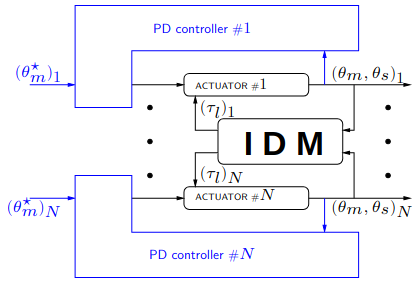 $\newline$ *Figure : Contôle centralisé selon le modèle de Lewis*

Il peut être démontré que :

* Le régulateur PD stabilise effectivement le modèle de rétroaction non linéaire.
* La position d'erreur $\varepsilon(t) \equiv \theta^*(t) - \theta(t)$ atteint une valeur constante en régime permanent, de plus en plus petite à mesure que $K_p$ augmente.
* $\varepsilon_{pos}$ peut être réduite en insérant un terme de rétroaction fonction de $q$ qui compense les effets gravitationnels.

### Linéarisation de la Rétroaction (Couple Calculé par Rétroaction)

#### Introduction

Qu'en est-il de la connexion du système $\ddot{y}(t) = - \dot{y}(t) + a\sqrt{y(t)} + u(t)$ avec le régulateur de rétroaction $u(t) = -a\sqrt{y(t)} - y(t)$ ?

On part du modèle suivant :
$$D_0(q) \ddot{q} + C_0(q, \dot{q})\dot{q} + g_0(q) = u$$

Le régulateur de rétroaction repose sur deux boucles emboîtées :

* **Boucle interne** : un régulateur non linéaire qui découple et linéarise la dynamique du robot. L'équation associée est $u = D_0(q) v + C_0(q, \dot{q}) \dot{q} + g_0(q)$, et le système en boucle fermée interne devient un ensemble de $N$ intégrateurs doubles parallèles et indépendants, décrits par $\ddot{q}_k = v_k$.
* **Boucle externe** : un ensemble de régulateurs linéaires classiques non interactifs, dont le rôle est de stabiliser les intégrateurs doubles ci-dessus. Ces régulateurs sont théoriquement totalement indépendants de la dynamique du robot. Il est à noter qu'ils peuvent également inclure une composante d'anticipation (feedforward).

#### Application et Diagramme Schématique Consequent
$\newline$
Modélisation du système en boucle fermée (parfois appelée "Méthode des couples calculés").
Le système complet en boucle fermée $(♢)$ peut être modélisé comme suit :

$$D_0(q) \ddot{q} + C_0(q, \dot{q}) \dot{q} + g_0(q) = u \quad \text{avec}$$
$$D_0(q) = D(q) + \text{diag} ( \{\frac{J_m}{r^2}\}_k)$$
$$C_0(q, \dot{q}) = C(q, \dot{q}) + \text{diag} ( \{\frac{B_{eff}}{r^2}\}_k)$$
$$u = \text{diag} ( \{\frac{\frac{K_m}{R}}{r}\}_k ) v \quad \text{où} \quad v = (v_1, \ldots, v_N)$$.

La loi de commande s'exprime comme suit :
$$u = D_0(q) \bar{u} + C_0(q, \dot{q}) \dot{q} + g_0(q) \quad \text{avec} \quad \bar{u} = \ddot{q}^\star + K_D (\dot{q}^\star - \dot{q}) + K_P (q^\star - q)$$

#### En Bref

$\newline$

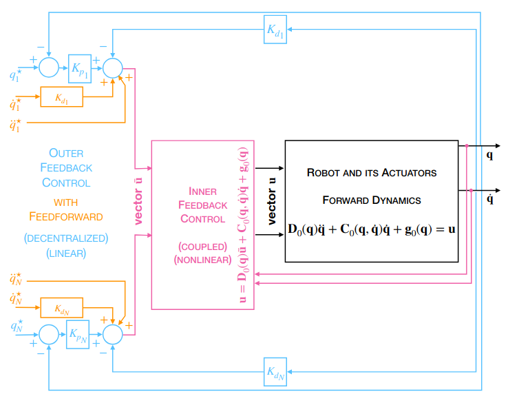 $\newline$ *Figure : Schéma bloc du contôle centralisé linéarisé*

#### Avantages et Inconvénients

**Avantages :**

* Stratégie très attrayante !
* Découplage et linéarisation.
  
**Inconvénients :**

* Nécessite un excellent modèle du robot - sinon, une version adaptative ou robuste est nécessaire.
* Nécessite une puissance de calcul importante (en raison de nombreuses calculs non linéaires).
* La dynamique du robot doit être simplifiée pour synthétiser le régulateur interne.
* Certaines propriétés importantes du système de rétroaction peuvent être perdues, par exemple, la stabilité, le découplage, etc. Une solution peut consister à utiliser des techniques de contrôle robuste linéaire pour concevoir le régulateur externe, en intégrant la différence entre le système de rétroaction réel et idéal dans une incertitude dont la réalisation en pire cas est considérée.