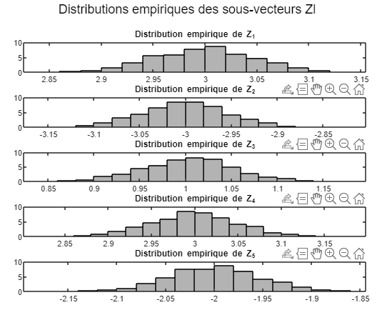
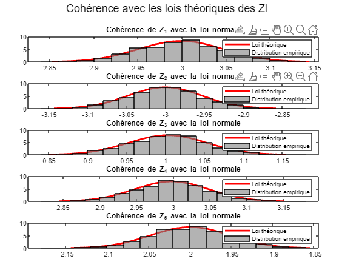
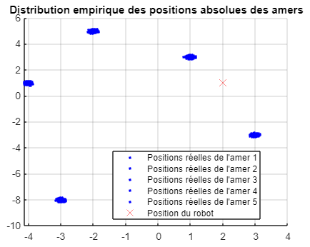
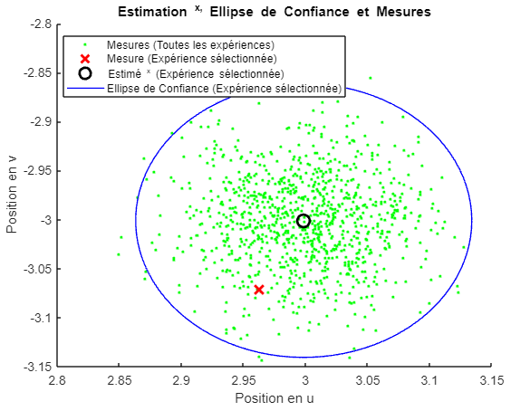
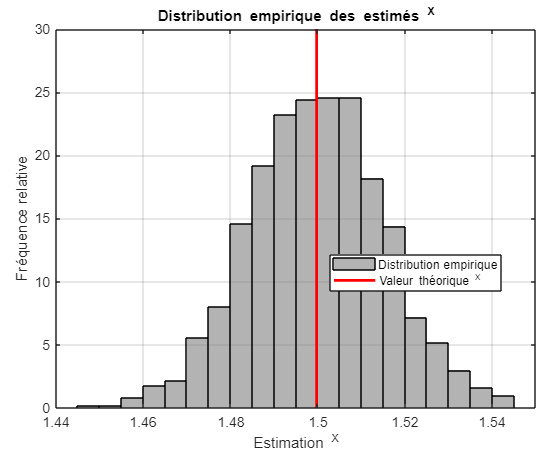
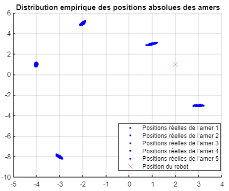
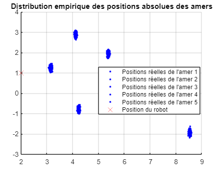

# Compte rendu de Travaux Pratiques
*GIBERT Alexis et Souha GHAZOUANI UPSSITECH SRI 2A*

## Cas d'étude 1 - Fonction h(.) affine, bruits indépendants identiquement distribués

L'équation de mesure (1) satisfait :
$$
\begin{gathered}
h(x)=\left(h_1(x), \ldots, h_L(x)\right)^T, \text { avec } \forall l \in\{1, \ldots, L\}, h_l(x)=m_l-x=\left(\begin{array}{c}
\overrightarrow{R M_l} \cdot \vec{x}_0 \\
\overrightarrow{R M_l} \cdot \vec{y}_0
\end{array}\right)=\left(\begin{array}{c}
u_l-u \\
v_l-v
\end{array}\right) \quad (2) \\
\bar{v}=0, C_v=\sigma^2 \mathbb{I} \text { avec } \sigma \text { donné. }
\quad (3) \end{gathered}
$$

### Question 1 : Sauvegarde des réalisations
#### Consignes
Invoquer séquentiellement `simulationDonnees.m` de façon à exécuter un nombre $N$ suffisamment élevé d'expériences aléatoires. Stocker les réalisations (ou "échantillons") de $Z$ obtenues sur ces expériences. Noter la valeur de $\sigma$.

#### Programme Matlab
```matlab
N = 1000; % Nombre d'expériences aléatoires
L = 5; % Nombre d'amers

% Préallocation de la matrice pour stocker les réalisations de Z
Z_samples = zeros(2 * L, N);

% Appels séquentiels à la fonction simulationDonnees
for i = 1:N
    % Modifier le dernier argument de la fonction selon votre cas d'étude
    [Z,L,m,H,Hfull,bar_v,C_v,x] = simulationDonnees(1,0);
    
    % Stocker la réalisation de Z dans la matrice
    Z_samples(:, i) = Z;
end

% Calculer la valeur de sigma à partir des réalisations de Z
sigma_estimate = std(Z_samples(:));

% Afficher la valeur de sigma
disp(['Valeur de sigma : ' num2str(sigma_estimate)]);
```
**Output**
```
Valeur de sigma : 3.77
```

### Question 2 : Visulaisation des distributions empiriques et cohérences avec les loi théoriques

#### Consignes
Visualiser graphiquement :
- (a) les distributions empiriques des échantillons des sous-vecteurs 
      $Zl, l = 1, . . . , L ;$
- (b) leur cohérence avec les lois théoriques des 
      $Zl, l = 1, . . . , L ;$
- (c) la distribution empirique des positions absolues (i.e., dans F0) 
des amers pouvant être établie sur la base des échantillons de Z si 
on suppose ponctuellement que x est donné. 

#### (a) Distributions empiriques des échantillons des sous-vecteurs $Zl$
```matlab
if FIGURE1==1
    figure(1);
    for l = 1:L
        subplot(L, 1, l);
        histogram(Z_samples(l, :), 'Normalization', 'pdf');
        title(['Distribution empirique de Z_' num2str(l)]);
    end
    sgtitle('Distributions empiriques des sous-vecteurs Zl');
end
```

<center>

 <br> *Figure 1 : Distributions empiriques des échantillons des sous-vecteurs $Zl$*

</center>

#### (b) Cohérence avec les lois théoriques des $Zl$
```matlab
if FIGURE2==1
    figure(2);
    for l = 1:L
        subplot(L, 1, l);
        
       % Plot de la densité de probabilité théorique (loi normale)
        x_values = linspace(mean(Z_samples(l, :)) - 3 * std(Z_samples(l, :)), ...
            mean(Z_samples(l, :)) + 3 * std(Z_samples(l, :)), 100);
        pdf_values = normpdf(x_values, mean(Z_samples(l, :)), ...
            std(Z_samples(l, :)));
        plot(x_values, pdf_values,'LineWidth', 2);
        hold on;
        histogram(Z_samples(l, :), 'Normalization', 'pdf');
        title(['Cohérence de Z_' num2str(l) ' avec la loi normale']);
        legend('Loi théorique', 'Distribution empirique');
        hold off;
    end
    sgtitle('Cohérence avec les lois théoriques des Zl');
end
```

<center>

 <br> *Figure 2 : Cohérence avec les lois théoriques des $Zl$*

</center>

#### (c) Distribution empirique des positions absolues des amers
```matlab
if FIGURE3==1
    figure(3);
    hold on;
    title('Distribution empirique des positions absolues des amers');
    
    % Afficher les positions absolues réelles des amers
    for i = 1:2:2 * L
        plot(Z_samples(i, :), Z_samples(i + 1, :), 'b.', 'MarkerSize', 8);
    end
    
    % Marquer la position du robot
    plot(x(1), x(2), 'rx', 'MarkerSize', 10);
    legend('Positions réelles de l''amer 1', ...
        'Positions réelles de l''amer 2', ...
        'Positions réelles de l''amer 3',...
        'Positions réelles de l''amer 4',...
        'Positions réelles de l''amer 5',...
        'Position du robot');
    
    hold off;
end
```

<center>

 <br> *Figure 3 : Distribution empirique des positions absolues des amers*

</center>

### Question 3 : Un peu de théorie...
On décide d’estimer $x$ caché au moyen de l’estimateur

$$\hat{\mathrm{X}}=\frac{1}{L} \sum_{l=1}^L \mathrm{Y}_l, \mathrm{Y}_l=m_l-\mathrm{Z}_l$$

#### Consignes
Calcul théorique - Montrer que $\hat{X}$ est Gaussien. Calculer son biais théorique, ainsi que sa matrice de covariance. Déduire les statistiques du vecteur erreur d'estimation, ainsi que la valeur de l'erreur quadratique moyenne.

#### $\hat{X}$ est Gaussien ?

$$\hat{\mathrm{X}}=\frac{1}{L} \sum_{l=1}^L m_l-\mathrm{Z}_l$$

$$Z_l \text{ est Gaussien} \rightarrow \hat{X} \text{ est Gaussien aussi}$$

#### Calcul du biais théorique

Comme $E[\hat{X}]=\frac{1}{L}\sum_{l=1}^L E[Y_l]=\frac{1}{L}\sum_{l=1}^L m_l-E[Z_l]$ et comme $Biais(\hat{X})=E[\hat{X}]-x=\frac{1}{L} \sum_{l=1}^L m_l-E[Z_l]-x$ alors

$$Biais(\hat{X})=\frac{1}{L} \sum_{l=1}^L m_l-x$$

#### Matrice de covariance

La matrice de covariance de $\hat{X}$ est
$$Cov(\hat{X})=\frac{1}{L} Cov(Y_l)$$

#### Erreur quadratique moyenne (EQM)

$$EQM=\frac{1}{L} \sum_{l=1}^L C_v$$


### Question 4 : Ellipse de confiance

#### Consignes
Sur une expérience, produire un estimé $\hat{x}$ de $x$. Tracer autour de $\hat{x}$ un ellipse de confiance dans lequel x doit théoriquement se trouver avec une probabilité de 99%. Vérifier la plausibilité du résultat.

#### Programme Matlab
```matlab
% Calcul de l'estimation ^x
hat_x = mean(Z_samples, 2);

% Calcul de la matrice de covariance Cov^X
Cov_hat_X = cov(Z_samples');

% Sélection d'une expérience pour l'analyse
experience_index = 1;

% Extraction des résultats de cette expérience
Z_experiment = Z_samples(:, experience_index);
hat_x_experiment = hat_x;
Cov_hat_X_experiment = Cov_hat_X;

% Calcul des valeurs propres et vecteurs propres de la matrice de covariance
[~, D] = eig(Cov_hat_X_experiment);

% Calcul des angles associés aux vecteurs propres
angles = atan2(D(2, 2), D(1, 1));

% Calcul des demi-axes de l'ellipse de confiance
confidence_level = 0.99;
radius_x = sqrt(chi2inv(confidence_level, 2)) * sqrt(D(1, 1));
radius_y = sqrt(chi2inv(confidence_level, 2)) * sqrt(D(2, 2));

% Paramètres pour tracer l'ellipse de confiance
theta = linspace(0, 2 * pi, 100);
ellipse_x = hat_x_experiment(1) + radius_x * cos(theta);
ellipse_y = hat_x_experiment(2) + radius_y * sin(theta);

if FIGURE4==1
    % Trace l'estimé ^x et l'ellipse de confiance
    figure(4);
    scatter(Z_samples(1, :), Z_samples(2, :), 'g.');
    hold on;
    plot(Z_experiment(1), Z_experiment(2), 'rx', 'MarkerSize', 10, ...
        'LineWidth', 2);
    plot(hat_x_experiment(1), hat_x_experiment(2), 'ko', 'MarkerSize', ...
        10, 'LineWidth', 2);
    plot(ellipse_x, ellipse_y, 'b', 'LineWidth', 1);
    hold off;
    title('Estimation ^x, Ellipse de Confiance et Mesures');
    xlabel('Position en u');
    ylabel('Position en v');
    legend('Mesures (Toutes les expériences)', ...
        'Mesure (Expérience sélectionnée)', ...
        'Estimé ^x (Expérience sélectionnée)', ...
        'Ellipse de Confiance (Expérience sélectionnée)', ...
        'Location', ...
        'Best');
end 

% Calcule la distance euclidienne entre chaque mesure et l'estimation ^x
distances = sqrt((Z_samples(1, :) - hat_x_experiment(1)).^2 ...
    + (Z_samples(2, :) - hat_x_experiment(2)).^2);

% Calcule le nombre de mesures à l'intérieur de l'ellipse de confiance
inside_ellipse = distances < radius_x & distances < radius_y;
percentage_inside_ellipse = sum(inside_ellipse) / numel(inside_ellipse) * 100;

% Affiche le pourcentage de mesures dans l'ellipse de confiance
fprintf('Pourcentage de mesures dans l''ellipse de confiance : %.2f%%\n', ...
    percentage_inside_ellipse);
```

<center>

 <br> *Figure 4 : Estimation $\hat{x}$, Ellipse de Confiance et Mesures*

</center>

**Output**
```
Pourcentage de mesures dans l'ellipse de confiance : 98.10%
```
Ainsi le résultat de 99% est plausible.


### Question 5 : Distribution empirique des estimés
#### Consignes
Par exploitation des échantillons de $Z$ sur plusieurs résultats d'expériences, visualiser la distribution empirique des estimés $\hat{x}$ de $x$. Vérifier qu'elle est cohérente avec la loi théorique de $X$.

#### Programme Matlab
```matlab
% Calcule les estimés ^X pour chaque ensemble d'échantillons
estimated_X_samples = mean(m - Z_samples, 1);

% Calcule la loi théorique ^X
theoretical_X = mean(m - mean(Z_samples, 2));

% Affiche la distribution empirique des estimés ^X et la valeur théorique
if FIGURE5==1
    figure(5);
    histogram(estimated_X_samples, 'Normalization', 'pdf', 'EdgeColor', ...
        'k', 'FaceColor', [0.5 0.5 0.5]);
    hold on;
    plot([theoretical_X theoretical_X], [0 30], 'r', 'LineWidth', 2);
    hold off;
    title('Distribution empirique des estimés ^X');
    xlabel('Estimation ^X');
    ylabel('Fréquence relative');
    grid on;
    legend('Distribution empirique', ...
        'Valeur théorique ^X', ...
        'Location', ...
        'Best');
end 
```

<center>

 <br> *Figure 5 : Distribution empirique des estimés $\hat{X}$*

</center>

Comme le prouve le graphique ci-dessus la distribution est cohérente avec la loi théorique puique la distribution est bien centrée sur la valeur théorique.


## Cas 2 - Fonction h(.) affine, bruits mutuellement indépendants mais non identiquement distribués

L'équation de mesure (1) est formulée comme suit :
$$h(x) = \begin{bmatrix} h_1(x) & \ldots & h_L(x) \end{bmatrix}, \text{ avec } \forall l \in \{1, \ldots, L\},
h_l(x) = m_l - x = \begin{bmatrix} \overrightarrow{RM_l} \cdot \overrightarrow{x_0} \\ \overrightarrow{RM_l} \cdot \overrightarrow{y_0} \end{bmatrix} = \begin{bmatrix} u_l - u \\ v_l - v \end{bmatrix} \quad (5)$$

où $\bar{v} = 0$ et $C_v = \text{blkdiag}(Cv_1, \ldots, Cv_L)$, avec $Cv_1, \ldots, Cv_L$ étant des matrices de covariance données.$\quad (6)$

### Question 6 : Sauvegarde des réalisations
#### Consignes
Invoquer séquentiellement simulationDonnees.m de façon à exécuter un nombre N suffisamment élevé d'expériences aléatoires. Stocker les réalisations (ou "échantillons") de Z obtenues sur ces expériences.

#### Programme Matlab
```matlab
N = 1000; % Nombre d'expériences aléatoires
L = 5; % Nombre d'amers

% Initialisation des matrices pour stocker les résultats
Z_samples_2 = zeros(2 * L, N);

% Boucle pour exécuter N expériences aléatoires
for i = 1:N
    % Appel de la fonction de simulation
    [Z,L,m,H,Hfull,bar_v,C_v,x] = simulationDonnees(2, 0);

    % Stocke la réalisation de Z dans la matrice
    Z_samples_2(:, i) = Z;
end
```

### Question 7 : Distribution empirique des positions absolues des amers
#### Consignes
Visualiser graphiquement la distribution empirique des positions absolues (i.e., dans F0) des amers pouvant être établie sur la base des échantillons de Z si on suppose ponctuellement que x est donné.

#### Programme Matlab
```matlab
% Visualisation graphique
figure;
hold on;
grid on;
title('Distribution empirique des positions absolues des amers');

% Affiche les positions absolues réelles des amers
for i = 1:2:2 * L
    plot(Z_samples_2(i, :), Z_samples_2(i + 1, :), 'b.', 'MarkerSize', 8);
end

% Marque la position du robot
plot(x(1), x(2), 'rx', 'MarkerSize', 10);
legend('Positions réelles de l''amer 1', ...
    'Positions réelles de l''amer 2', ...
    'Positions réelles de l''amer 3',...
    'Positions réelles de l''amer 4',...
    'Positions réelles de l''amer 5',...
    'Position du robot');
hold off;
```

<center>

 <br> *Figure 12 : Distribution empirique des positions absolues des amers*

</center>

### Question 8 : Un peu de théorie ...
#### Consignes
Calcul théorique - Établir l'expression de $\hat{X}_{MLE}$. Démontrer que $\hat{X}$ et $\hat{X}_{MLE}$ suivent tous deux une distribution gaussienne. Calculer leurs biais théoriques et matrices de covariance. En déduire, pour chacun d'eux, les statistiques du vecteur d'erreur d'estimation, ainsi que la valeur de l'erreur quadratique moyenne. La matrice de covariance de $\hat{X}_{MLE}$ sera notée $\text{Cov}(\hat{X}_{MLE})$.

### Estimateur du Maximum de Vraisemblance ($\hat{X}_{MLE}$) :

Pour estimer $x$ au moyen de l'estimateur $\hat{X}$ défini dans la section précédente en (4) ainsi que par l'estimateur du maximum de vraisemblance ($\hat{X}_{MLE}$), commençons par établir l'expression de $\hat{X}_{MLE}$.

L'estimateur du maximum de vraisemblance ($\hat{X}_{MLE}$) est obtenu en maximisant la fonction de vraisemblance. La fonction de vraisemblance est définie comme la probabilité de l'observation $Z$ sachant les paramètres $x$, notée $p(Z \mid x)$.

La fonction de vraisemblance pour le modèle décrit par l'équation (1) est donnée par :

$$p(Z \mid x) = \frac{1}{(2\pi)^{L} \sqrt{\det(C_v)}} \exp\left(-\frac{1}{2}(Z - h(x))^T C_v^{-1} (Z - h(x))\right)$$

L'estimateur du maximum de vraisemblance $\hat{X}_{MLE}$ est obtenu en maximisant cette fonction par rapport à $x$, ce qui équivaut à minimiser l'expression suivante :

$$L_{MLE}(x) = \frac{1}{2}(Z - h(x))^T C_v^{-1} (Z - h(x))$$

On peut calculer le minimum de $J_{MLE}(x)$ en dérivant par rapport à $x$ et en égalant à zéro :

$$\frac{\partial L_{MLE}}{\partial x} = -H^T C_v^{-1} (Z - h(x)) = 0$$

En résolvant cette équation, on obtient l'expression de $\hat{X}_{MLE}$ :

$$\hat{X}_{MLE} = (H^T C_v^{-1} H)^{-1} H^T C_v^{-1} Z$$

### Propriétés statistiques de $\hat{X}$ et $\hat{X}_{MLE}$ :

Les estimateurs $\hat{X}$ et $\hat{X}_{MLE}$ sont tous deux gaussiens, car ils sont obtenus à partir d'une combinaison linéaire de variables aléatoires gaussiennes.

#### Biais théoriques :
Le biais de l'estimateur $\hat{X}$ est donné par la différence entre l'espérance de l'estimateur et la vraie valeur du paramètre $x$. Pour $\hat{X}_{MLE}$, le biais est également égal à zéro car il est asymptotiquement sans biais.

$$\text{Bias}(\hat{X}) = \mathbb{E}[\hat{X}] - x$$
$$\text{Bias}(\hat{X}_{MLE}) = \mathbb{E}[\hat{X}_{MLE}] - x = 0$$

#### Matrices de Covariance :
Les matrices de covariance de $\hat{X}$ et $\hat{X}_{MLE}$ sont données par les formules suivantes :

$$\text{Cov}(\hat{X}) = \sigma^2 (H^T C_v^{-1} H)^{-1}$$
$$\text{Cov}(\hat{X}_{MLE}) = (H^T C_v^{-1} H)^{-1}$$

### Erreur Quadratique Moyenne (MSE) :
L'erreur quadratique moyenne (MSE) est la moyenne des carrés des erreurs entre l'estimateur et la vraie valeur du paramètre. Pour $\hat{X}$ et $\hat{X}_{MLE}$, la MSE est donnée par :

$$\text{MSE}(\hat{X}) = \text{Tr}(\text{Cov}(\hat{X}))$$
$$\text{MSE}(\hat{X}_{MLE}) = \text{Tr}(\text{Cov}(\hat{X}_{MLE}))$$

où $\text{Tr}(\cdot)$ représente la trace de la matrice.

### Question 9 : 
#### Consignes
Sur une expérience, générer les estimés $\hat{x}$ et $\hat{x}_{MLE}$ de $x$. Tracer autour de chacun d'eux une ellipse de confiance dans laquelle $x$ devrait théoriquement se trouver avec une probabilité de 99 %. Vérifier la plausibilité du résultat.

#### Programme Matlab
**Nous n'avons pas réussi a implémenter correctement l'ellipse en se basant sur le code de la question 4**

### Question 10 :
#### Consignes
Par l'exploitation des échantillons de $Z$ sur plusieurs résultats d'expériences, visualiser les distributions empiriques des estimés respectifs $\hat{x}$ et $\hat{x}_{MLE}$ de $x$. Vérifier qu'elles sont cohérentes avec les lois théoriques de $\hat{X}$ et $\hat{X}_{MLE}$.

Les bruits associés aux perceptions des différents amers par le robot étant mutuellement indépendants, on montre qu'on peut implémenter un calcul équivalent à l'estimé du maximum de vraisemblance $\hat{x}_{MLE}$ consistant en l'assimilation récursive (séquentielle) de chaque observation $y_l = Y_l(\omega)$. La démarche consiste à produire la séquence des estimés $\overset{\circ}{x}(1)$, ..., $\overset{\circ}{x}(L)$ et des matrices de covariances $P(1)$, ..., $P(L)$ définis comme suit, avec $H = I_{2 \times 2}$:

| Étape                     | Équation  |
|---------------------------|----------------------------------------------------------|
| **Initialisation**        | $\overset{\circ}{x}(1) = y_1 \quad (7)$ \newline $P(1) = C_{v1} \quad (8)$ |
||----------------------------------------------------------|
| **Pour $\forall l \in \{2, ..., L\}$** | $K(l) = P(l-1)H^T(C_{vl} + HP(l-1)H^T)^{-1} \quad (9)$ \newline $\overset{\circ}{x}(l) = \overset{\circ}{x}(l-1) + K(l)(y_l - H\overset{\circ}{x}(l-1)) \quad (10)$ \newline $P(l) = P(l-1) - K(l)HP(l-1) \quad (11)$ |
||----------------------------------------------------------|
| **Estimé/Covariance finaux** | $\hat{x}_{MLE} = \overset{\circ}{x}(L) \quad (12)$ \newline $\text{Cov}(\hat{X}_{MLE}) = P(L) \quad (13)$ |

**Nous n'avons pas réussi à implémenter cette fonctionnalité**

### Question 11 : Implémentation
#### Consignes
Implémenter le calcul. Vérifier le bon fonctionnement.

#### Programme Matlab

**Nous n'avons pas réussi à implémenter cette fonctionnalité**

### Question 12 : 
#### Consignes
Que se passerait-il si les bruits associés aux perceptions des différents amers par le robot n'étaient pas mutuellement indépendants ? (invoquer, par exemple, `simulationDonnees` avec l'argument `cas_d_etude` fixé à 0)

#### Programme Matlab

**Nous n'avons pas réussi à implémenter cette fonctionnalité**


## Cas d'étude 3 - Fonction h(.) non linéaire
L'équation de mesure (1) satisfait :

$$
\begin{gathered}
h(x)=\left(h_1(x), \ldots, h_L(x)\right)^T, \text { avec } \forall l \in\{1, \ldots, L\}, \\ h_l(x)=\left(\begin{array}{c}
\left\|R M_l\right\| \\
\overrightarrow{x_0, \overrightarrow{R M_l}}
\end{array}\right)=\left(\begin{array}{c}
\sqrt{\left(u_l-u\right)^2+\left(v_l-v\right)^2} \\
\operatorname{atan2(v_{l}-v,u_{l}-v)}
\end{array}\right) \quad (14) \\
\bar{v}=0, C_v \text { donnés. } \quad (15)
\end{gathered}
$$

### Question 11 : Sauvegarde des réalisations

#### Consignes
Invoquer séquentiellement simulationDonnees.m de façon à exécuter un nombre N suffisamment élevé d'expériences aléatoires. Stocker les réalisations (ou "échantillons") de $Z$ obtenues sur ces expériences.

#### Programme Matlab
```matlab
% Nombre d'expériences
N_exp = 1000;

% Initialise un tableau pour stocker les réalisations de Z
Z_samples = zeros(2 * L, N_exp);

% Répéte les expériences
for i = 1:N_exp
    % Appeler la fonction de simulation pour le cas 3
    [Z,L,m,H,Hfull,bar_v,C_v,x] = simulationDonnees(3,0);

    % Stocke la réalisation de Z dans le tableau
    Z_samples(:, i) = Z;
end
```

### Question 12 : Distribution empirique des positions absolues des amers
#### Consignes
Visualiser graphiquement la distribution empirique des positions absolues (i.e., dans F0) des amers pouvant être établie sur la base des échantillons de $Z$ si on suppose ponctuellement que $x$ est donné.

#### Programme Matlab
```matlab
if FIGURE1==1
    figure(3);
    hold on;
    grid on;
    title('Distribution empirique des positions absolues des amers');
    
    % Affiche les positions absolues réelles des amers
    for i = 1:2:2 * L
        plot(Z_samples(i, :), Z_samples(i + 1, :), 'b.', 'MarkerSize', 8);
    end
    
    % Marque la position du robot
    plot(x(1), x(2), 'rx', 'MarkerSize', 10);
    legend('Positions réelles de l''amer 1', ...
        'Positions réelles de l''amer 2', ...
        'Positions réelles de l''amer 3',...
        'Positions réelles de l''amer 4',...
        'Positions réelles de l''amer 5',...
        'Position du robot');
    hold off;
end
```
<center>

 <br> *Figure 12 : Distribution empirique des positions absolues des amers*

</center>

Grâce a ce graphique on peut visualiser les positions des 

### Question 13 : Un peu de théorie ...
#### Consigne
On décide d’estimer $x$ caché au moyen de l’estimateur du maximum de vraisemblance $\hat{\mathrm{X}}_{\mathrm{MLE}}$. 

Calcul théorique - Etablir l’expression du problème d’optimisation permettant le calcul de l’estimé du maximum de vraisemblance $\hat{\mathrm{x}}_{\mathrm{MLE}}$ sur la base du vecteur $z$. Développer l’algorithme de Gauss-Newton permettant sa résolution.

#### Elements de réponse
L'estimateur du maximum de vraisemblance (MLE) est obtenu en maximisant la fonction de vraisemblance. La fonction de vraisemblance est définie comme la probabilité conditionnelle des observations données les paramètres du modèle. Dans le cas gaussien, cette probabilité est liée à la densité de probabilité gaussienne.

Supposons que $Z$ représente le vecteur des observations et $x$ soit le vecteur des paramètres à estimer. La fonction de vraisemblance $L(x)$ pour un ensemble d'observations $Z$ est donnée par la densité de probabilité jointe des observations, conditionnée par les paramètres $x$. Dans le cas gaussien, cela est lié à la fonction de densité de probabilité multivariée gaussienne.

La forme générale de la fonction de vraisemblance gaussienne est donnée par :

$$L(x) = \frac{1}{\sqrt{(2\pi)^N \det(C_v)}} \exp\left(-\frac{1}{2} (Z - h(x))^T C_v^{-1} (Z - h(x))\right)$$

où $N$ est la dimension de l'espace des observations, $C_v$ est la matrice de covariance des erreurs, et $h(x)$ est la fonction qui relie les paramètres $x$ aux observations $Z$.

L'estimateur du maximum de vraisemblance ($\hat{x}_{MLE}$) est obtenu en maximisant cette fonction de vraisemblance. Cela revient à résoudre le problème d'optimisation suivant :

$$\hat{x}_{MLE} = \arg \max_x L(x)$$

En pratique, il est souvent plus pratique de maximiser le logarithme de la fonction de vraisemblance, appelé le logarithme de vraisemblance ($\log L(x)$), car cela simplifie les calculs. Ainsi, le problème d'optimisation devient :

$$\hat{x}_{MLE} = \arg \max_x \log L(x)$$

L'algorithme de Gauss-Newton est une méthode itérative utilisée pour résoudre des problèmes d'optimisation non linéaires. Pour chaque itération, il utilise une approximation linéaire du modèle basée sur le développement en série de Taylor. L'algorithme effectue des mises à jour successives des paramètres jusqu'à ce qu'une convergence satisfaisante soit atteinte.

L'itération de l'algorithme de Gauss-Newton peut être formulée comme suit :

$$x_{k+1} = x_k + (J_k^T C_v^{-1} J_k)^{-1} J_k^T C_v^{-1} (Z - h(x_k))$$

où $x_k$ est l'estimation courante des paramètres, $J_k$ est la matrice jacobienne de la fonction $h(x)$ évaluée en $x_k$, et $C_v$ est la matrice de covariance des erreurs.

Cela doit être répété jusqu'à ce qu'un critère de convergence soit satisfait, comme l'atteinte d'un nombre maximal d'itérations ou la convergence des mises à jour des paramètres en dessous d'un seuil pré-défini.


### Question 14 : 
Procéder à l implémentation de l’algorithme de Gauss-Newton. Tracer autour de l’estimé $\hat{\mathrm{x}}_{\mathrm{MLE}}$ obtenu un ellipse de confiance dans lequel $x$ doit se trouver approximativement avec une probabilité de 99 %. Vérifier la plausibilité.

**Nous n'avons pas réussi à implémenter cette fonctionnalité**