## Caractéristique d'un projet

* **Unicité** : Le produit d'un projet est unique ou réalisé à un petit nombre d'exemplaires. Il y a donc une idée de durée limitée : tout projet a un début et une fin .
* **Objectifs** : Des objectifs clairement définis qui permettent la satisfaction d'un besoin spécifique et particulier. La gestion du temps est au centre de la gestion de projet.
* **Temps** : La dimension temporelle est fondamentale dans un projet
* **Innovation** : L ’innovation dans un projetest au moins partielle .
* **Des contraintes : de délai de qualité et de coût**

### Favoriser l’innovation 

Les premiers projets....
* Les pyramides, les cathédrales, les fortifications : Très peu de moyens techniques, plan ? Organisation du travail, logistique, motivation
* Les villes, les routes, les canaux : Planification (cadastre, perspectives, écoles)
* Les grandes découvertes (financement, cartes)
* Les projets modernes internationaux : Projet Manhattan, Overlord, Apollo....

Plusieurs facteurs doivent être présents pour permettre l’innovation : Besoin, Leadership, Motivation, Main d’œuvre disponible, Facteurs socio économiques...

L’innovation n’est pas simplement le fait du progrès technique....

### Les Ressources Humaines du projet
1. **Le Maître d’Ouvrage** (ou porteur du projet ou commanditaire) : "Personne physique ou morale pour le compte de qui l’objet du projet est réalisé, responsable de la définition des objectifs du projet et de la décision d’investir dans le projet."
2. **Le Maître d’Oeuvre** (ou réalisateur) : "Personne physique ou morale qui, pour sa compétence, est chargée par le maître d’ouvrage de la réalisation du projet."

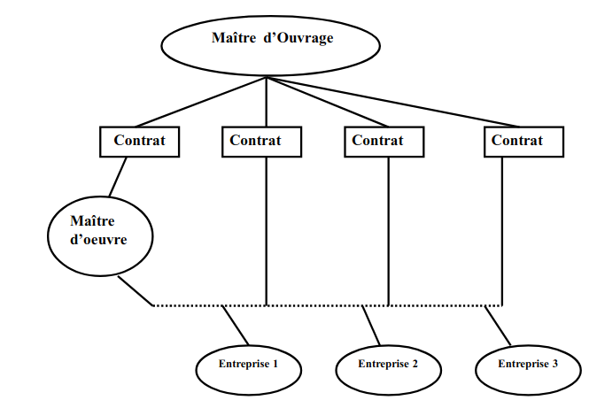

Organisation : le Maître d’Oeuvre architecte industriel

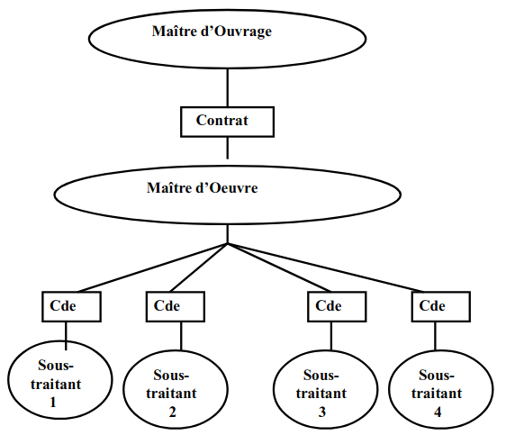

Organisation : le Maître d’Oeuvre ensemblier

3. **Les parties prenantes** : "Personne ou groupe de personne ayant un intérêt commun dans lesrésultats de l’organisme fournisseur (l’organisme en charge du projet) et dans l’environnement dans lequel il agit." (ISO 9000) Elles peuvent être :
    * un client, bénéficiaire du produit du projet
    * un consommateur, par exemple, l’utilisateur du produit du projet
    * un propriétaire, par exemple, l’initiateur du projet
    * un bailleur de fonds
    * un sous contractant, organisme qui fournit des produits à l’organismeen charge du projet...

**Un travail d’équipe multi compétentes** : Il est très rare de trouver un projet ne comportant qu’un seul métier, dans de nombreux cas la réalisation d’un projet mobilise plusieurs corps de métier. Cette diversité justifie d'ailleurs souvent la 
mise en place d'un dispositif de coordination. Il faut donc mettre en place des formes d’organisation favorisant la réalisation du projet.

**4 type de structures organisationnelles de projet**
1. **Projet avec facilitateur**
    * Le facilitateur peut être un jeune cadre ou un assistant de la direction. Il est considéré comme le véritable responsable du projet. 
    * Le facilitateur met de l’huile dans les rouages, fait circuler l’information, propose des suggestions aux divers intervenants. Il est essentiellement une courroie de transmission. Il n’a aucun contrôle sur l’utilisation des ressources. 
    * Ce type d’organisation est utilisée lorsque :
        * la division du travail entre les diverses cellules de l’entreprise est bien définie,
        * les lignes de communication entre ces cellules sont bien établies, sont fixes et fonctionnent correctement,
        * l’importance et les enjeux du projet sont relativement faibles.

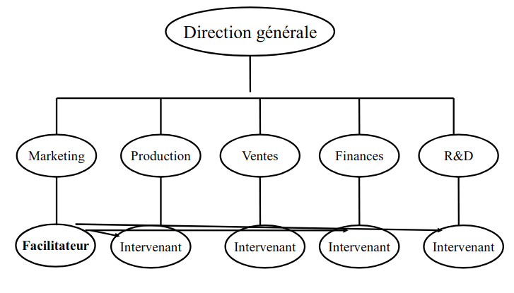

Management par projet avec facilitateur dans une organisation fonctionnelle

2. **Projet avec "coordinateur"**
    * Désigné dans l'organisation il est directement rattaché à la direction générale. 
    * N’a pas d’autorité hiérarchique sur le personnel amené à travailler sur le projet. Mais a une autorité fonctionnelle qui lui permet d’agir et prendre des décisions (dans les domaines financiers, procédures et délai).
    * Ce responsable fonctionnel dispose de pouvoir découlant de sa position, de son niveau d’expertise et de ses compétences. 

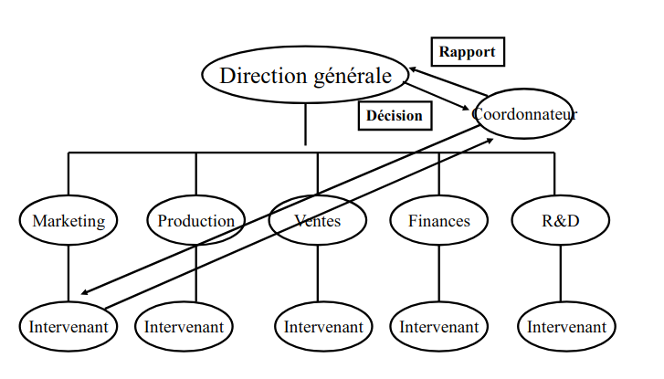

Management par projet avec Coordonnateur dans une organisation fonctionnelle

3. **Projet "matriciel"**
    * Le chef de projet planifie, organise et contrôle l’activité du personnel sur le projet mais seulement dans le cadre du projet dont il a la responsabilité.
    * Il est responsable de l’utilisation des ressources pour son projet, mais le personnel dépend hiérarchiquement de sa direction d’origine. Dans le cas où la taille du projet le justifie, le chef de projet peut disposer d’une équipe qui lui est rattaché hiérarchiquement et qui l’aide dans sont rôle.
    * Son autorité dépend de ses capacités relationnelles et du statut du responsable hiérarchique dont il peut solliciter l’arbitrage.
    * Ce type d’organisation peut être adopté pour réaliser des projets importants pour l’entreprise.

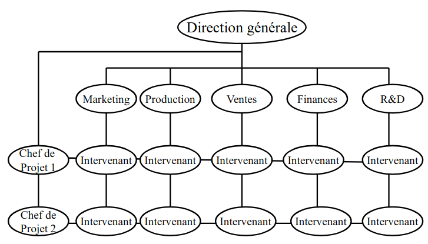

Management par projet dans une organisation fonctionnelle/matricielle

4. **Projet en "task-force" (structure dédiée)**

    * Le chef de projet a la responsabilité complète du projet, érigé en structure totalement indépendante. Il est comme le directeur général d’une entreprise devant transformer des ressources qui sont mises à sa disposition, en ouvrage répondant aux objectifs désignés. Il supervise hiérarchiquement l’ensemble du personnel travaillant sur le projet. 
    * Le personnel du projet est détaché de sa direction d’origine. 
    * Cette structure est utilisée pour les projet urgents, ou dans des projets où il faut géographiquement concentrer le personnel (secteur BTP).

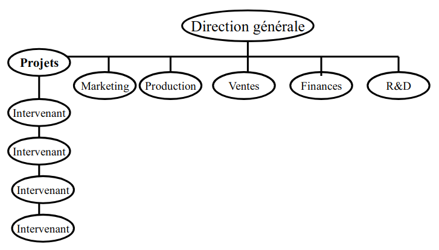

Management par projet dans une organisation par projet/produit/task force

|Critères|Facilitateur|Coordinateur|Matriciel|Task-force|
|--|--|--|--|--|
|Degré d'incertitude|Faible|Faible|Important|Important|
|Complexité technologique|Standard|Standard|Tech. Compliquée|Tech. Nouvelle|
|Taille du projet|Faible|Faible|Moyenne|Importante|
|Importance relative du projet|Très faible|Faible|Moyenne|Importante|
|Durée|Faible|Faible|Moyenne|Importante|
|Complexité des relations|Très faible|Faible|Moyenne|Importante|
|Criticité des délais|Faible|Faible|Moyenne|Importante|
|Différentiation avec d'autres projets|Faible|Faible|Importante|Moyenne|

Critères de choix entre les différents type de managment de projet

### Méthodologie du projet

Nécessité d’une méthode : Paradoxe du management de projet
* Au début du projet : grande capacité d'action mais peu de connaissance
* A la fin du projet : faible capactité d'action mais beaucoup de connaissances

Exemple de modèles : modèle en Cascade (GANTT mais sans valeur de temps)

Les Premiers Outils : Il faut commencer par détailler les tâches nécessaires à l’accomplissement du projet, c’est
l’organigramme des tâches.

|Modèle|Description|Image|
|--|--|--|
|Organigramme des tâches (OT) = **Work Breakdown Structure (WBS)** = Arborescence technique|On associe à chaque tâche : une durée, une date début au + tôt / + tard, une date de fin au + tôt / + tard, une marge totale, une marge libre, des contraintes d'antériorité (définition des ancêtres et des descendants)|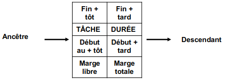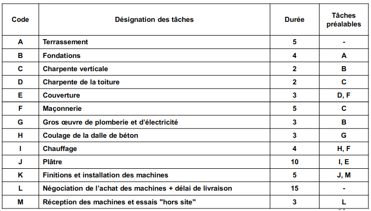|
|Ordonnancement - **Le PERT**|Première méthode d'ordonnancement largement répandue, le PERT (Program Evaluation and Review Technic) date selon de nombreux auteurs de 1958. (Rayburn, projet Polaris, 250 fournisseurs 9000 commandes)|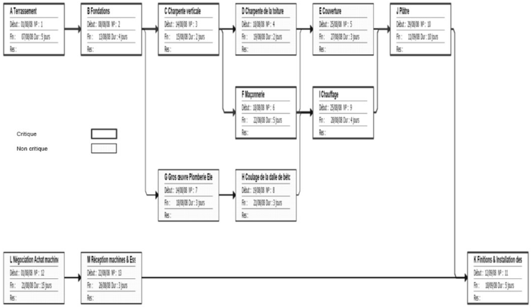|
|Le GANTT|Permet de suivre le projet, de vérifier les écarts des réalisés/prévisions, de mesurer l’impact des retards sur les différentes taches et l’impact global sur le projet.|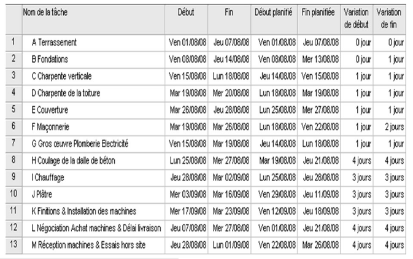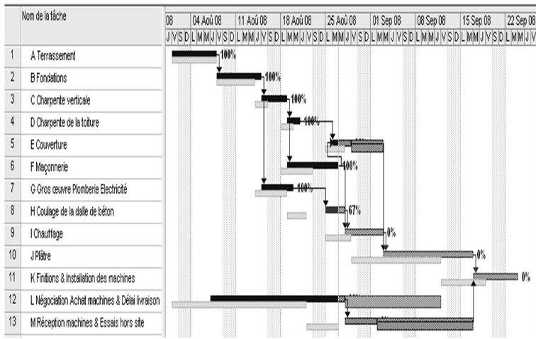|

### Financement du projet
|Budget prévisionnel|Budget prévisionnel|Cycle de vie du projet|
|--|--|--|
|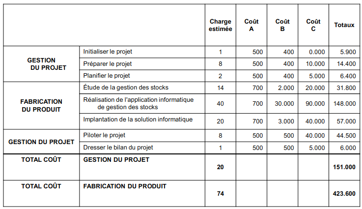|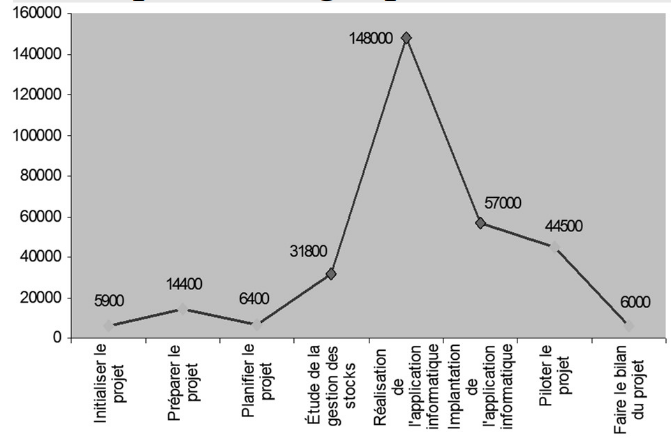|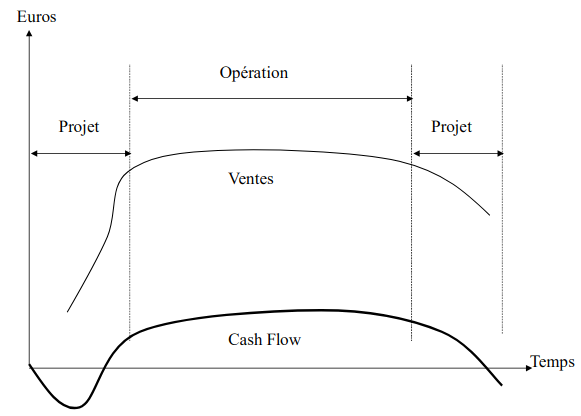|

### Managment de projet
* "Le management de projet c'est l’application de connaissances, des compétences, des outils et des méthodes, aux activités d’un projet, en vue d’atteindre ou de dépasser les besoins et les attentes des parties prenantes du projet."
* Le management de projet comprend la **planification**, l’**organisation**, le **suivi de la progression** et la **maîtrise de tous les aspects du projet dans un processus continu**, afin d’atteindre ses objectifs.
* Les moyens mis en oeuvre peuvent comprendre le management, les services, le personnel, les finances, les infrastructures, les équipements, les techniques et les méthodes.

**Discipline de managment de projet**
1. **Le Plan de projet** : Il s’agit d’un document qui spécifie les exigences qui permettent d’atteindre l’(les)objectif(s) du projet. Dans le plan du projet, il faut mettre les exigences des parties prenantes, les objectifs du projet, la planification des différents processus du projet, le plan qualité, les caractéristiques du produit, la manière de les mesurer et de les évaluer, l’analyse d’avancement...
2. **Le Management de la coordination** : Ce domaine concerne les processus qui assurent l’intégration correcte des divers élément du projet. Cela comprend : l’élaboration du plan de projet, la mise en œuvre du plan de projet et la maîtrise d’ensemble de modification.
3. **Le Management du contenu du projet** : Ce domaine concerne les processus qui permettent d’assurer que le projet 
prévoit toutes les activités nécessaires, et seulement elles, pour réaliser le projet avec succès. Il comporte le démarrage du projet, la planification (du contenu), la définition et la vérification du contenu, et la maîtrise des modifications du contenu du projet.
4. **Le Management des délais du projet** : Ce domaine concerne les processus nécessaires pour assurer la réalisation du projet en temps voulu. Cela comporte l’identification des activités, le séquencement des activités, l’estimation de la durée des activités, l’ordonnancement des activités et la maîtrise du planning.
5. **Le Management des approvisionnements du projet** : Ce domaine concerne les processus mis en jeu pour l’acquisition de biens et services extérieurs à l’organisation en charge du projet. Il comprend le programme d’approvisionnement, le programme de consultation, les consultations, le choix des fournisseurs, la gestion des contrats et la cloture des contrats.
6. **Le Management des coûts du projet** : Ce domaine concerne les processus nécessaires à l’exécution du projet dans les limites budgétaires fixées. Il comporte : la planification des ressources, l’estimation des coût, la budgétisation et la maîtrise des coûts.
7. **Plan Qualité** : C’est un document énonçant les pratiques, les moyens et la séquence des activités liées à la qualité spécifique à un produit, un projet ou un contrat particulier. Selon le contenu du plan, deux qualificatifs peuvent être utilisé : plan management qualité, plan assurance qualité.
    * **Le Management de la Qualité du Projet**  : Ce domaine concerne les processus nécessaires pour assurer que le projet répondra aux besoins pour lesquels il a été entrepris. Il comporte : la planification de la qualité, l’assurance de la qualité (ctrle) et la maîtrise de la qualité (fb).
    * **Assurance Qualité (logique de contrôle)** : Ensemble des activité préétablies et systématiques mises en œuvre dans le cadre du système qualité et démontrées en tant que besoin, pour donner la confiance appropriée en ce qu’une entité satisfera aux exigences pour la qualité.
8. **Le management de la communication du projet** : Ce domaine concerne les processus qui permettent d’assurer en temps
voulu et de façon appropriée la rédaction, la collecte, la diffusion, la conservation et le traitement final des informations du projet. Cela comporte la planification des communications, la diffusion de l’information, les rapports d’avancement et la clôture administrative.
9. **Le management des risques du projet** : Ce domaine concerne des processus permettant l’identification, l’analyse et la 
prise en compte des risques de projet. Il concerne l’identification des risques, la quantification des risques, l’élaboration d’une réponse aux risques et la maîtrise des réponses aux risques.
10. **Le Management des Ressources Humaines du Projet** : Ce domaine concerne les processus nécessaires au meilleur emploi 
possible des personnels impliqués dans le projet. Il comporte la planification de l’organisation, l’obtention des ressources humaines des effectifs et le développement de l’équipe.
11. **Rapport d’avancement** : Document périodique de synthèse décrivant :
    - les événements et problèmes principaux rencontrés dans la période écoulée,
    - le travail effectivement réalisé durant cette période pour chacune des prestation du contrat, 
    - l’avancement de ce dernier par rapport au travail planifié (référence) ou au travail à effectuer,
    - Le travail planifié pour la période suivante.

Planning standard d’implémentation : « une mise en place en 7 mois »

## Des méthodes Classiques vers Agile et Scrum

### Méthodes Classiques
|Méthodologie|Description|Avantages|Inconvénients|
|--|--|--|--|
|**Cycle de Vie en Cascade**|Introduction en 1966. Modélisation par Winston W Royce en 1970. Il consiste à découper le projet en phases et de terminer chaque phase avant d’enchainer. Chaque phase doit se terminer à une date précise et faire l’objet d’un livrable|Simplicité et intuitivité de mise en oeuvre Cadrage et planification du processus de développement Connaissance du planning par le client Accent sur la documentation Adapté au projets stables et dont les spécification évoluent peu|Faible tolérance à l’erreur et au changement Les défauts et les problèmes sont identifiés tardivement Les besoins doivent être déterminés dès le début du projet Le client doit attendre la fin du projet. Effet Tunnel Forte dépendance au planning qui tient lien d’indicateur qualité|
|**Cycle en V**|C’est une évolution du cycle en cascade dans les années 80 et adaptés aux projets informatiques : Qui n’ont pas une progression visible, Qui peuvent faire l’objet de nombreuses modifications dans les specs (pas de brick&mortar), Dont le client maitrise mal les aspects besoins/solutions Ce cycle permet de faire le lien entre les phases de conception ou de réalisation et les phases de tests Les erreurs détectées lors des phases de tests remettent ainsi en cause la phase de conception associée.|Simplicité de mise en oeuvre Connaissance du planning en avance par le client Plus réactif que le modèle en cascade.|Faible tolérance à l’erreur et au changement Difficulté de définir tous les besoins dès le début du projet   Défauts problèmes sont identifiés tardivement car les tests de validation sont effectués tardivement La validation par le client est tardive, le risque est élevé de rejets, les couts de non qualité importants. Effet- Tunnel|
|**Cycle de vie en spirale**|Modèle introduit en 1988 par Barry Boehm S’appuie sur le modèle en V avec une étape de gestion des risques préalable à l’analyse des besoins Il s’appuie sur la livraison régulière de prototype (IHM) à destination du client.|Modèle adaptatif Livraison de prototypes ce qui permet une prise en main de l’utilisateur plus rapide (formation cycle d’utilisation, bac à sable) Augmentation de la visibilité et du Feed Back client Meilleure gestion des risques reportées en amont.|Adapté aux gros projets (on peut fournir plusieurs prototypes) Nécessité d’une méthode incrémentale stricte pour ne pas livrer une nouvelle fonctionnalité en omettant ou en modifiant un point qui fonctionnait précédemment. Risque de dérive du cahier des charges au contact du client et donc des problèmes de facturation.|
|**Cycle Itératif**| Propose de réduire le nombre de phases du projet, chaque itération est constituée de la définition des spécifications, de l’étape de codage, la réalisation de tests, puis une évaluation du travail fourni permettent de faire le bilan sur les difficultés rencontrées et l’évolution des fonctionnalités. Tous les livrables validés sont déployés vers l’utilisateur final (version beta, documentation...). On retrouve l’idée du cycle PDCA (Deming).|Flexibilité et souplesse : prise en compte des retours et des difficultés rencontrées à la fin de chaque itération et possibilité de varier par rapport au besoin initialement défini. Livraison de prototypes ce qui permet une prise en main rapide de l’utilisateur final (possibilité d’une démarche mkg stratégique). Amélioration continue|Orienté gros projets : les prototypes ne sont pas nécessaires si projet simple. Nécessité d’être vigilant lors des phases de tests pour ne pas livrer une nouvelle version moins fonctionnelle que la précédente.

### Méthodes Agiles VS. Itératives
L’agile se distingue de l’itératif car il est à la fois incrémental et itératif. 
* Quand une équipe agile effectue une itération, elle produit un incrément. 
* Chaque incrément va ajouter de nouvelles fonctions suite aux retours des utilisateurs finaux. Et il peut être affiné avec des fonctionnalités existantes, ce qui le rend itératif.
* Du modèle itératif introduit par B. Boehm (1986) vont se détacher les méthodes Extreme Programming (XP), Scrum ou 
encore Crystal Clear. 
* En 2001 aux USA on ensemble d’expert on émis le « Manifeste Agile »  qui tient lieu de fait fondateur des « Méthodes Agiles »

### Méthodes Agiles
"Agile = Iterative + Incremental". Les méthodes agiles partent du principe que définir et planifier dans les détails l'intégralité d'un produit avant de le développer est contre-productif.
Par définition c'est une approche itérative et incrémentale, qui est menée dans un esprit collaboratif avec juste ce qu'il faut de formalisme. Elle génère un produit de haute qualité tout en prenant en compte l'évolution des besoins des clients.

Manifeste Agile : précise que les éléments de droite sont importants, mais moins que ceux de gauche.
* Les individus et leurs interactions (plutôt que des processus et des outils)
* Un logiciel Opérationnel (plutôt qu’une documentation exhaustive)
* La collaboration avec le client (plutôt que le contractualisation des relations)
* L’acceptation des changements (plutôt que le suivi d’un plan)

**Scrum**
* Le **Product Owner** qui porte la vision du produit à réaliser (rerésentant généralement le client)
* Le **Scrum Master** garant de l'application de la méthodologie Scrum
* L'**équipe de dev.** qui réalise le produit
* Les **parties prenantes** donnent les idées, feedback et expriment les besoins

**Vocabulaire**
* User story : fonctionnalité du produit assez précisément décrite pour être inclue dans un sprint
* Tâche : Ensemble des étapes nécessaires pour réaliser pour réaliser une User Story
* Product backlog : ensemble des User Stories nécéssaires pour réaliser le produit
* Vélocité : C'est la capacité de l'équipe à délévrer de la valeur
* Sprint : une itération de 2 à 4 semaines max
* Poker planning : séance d'estimation des tâches
* Sprint planning : cérémonie de définition de ce que l'on va inclure dans le sprint
* Standup meeting : mélée quotidienne, debout 15 min max
* Point de démarrage : un créneau en cas de problème
* Sprint review : démo de ce qui a été réalisé au court du sprint
* Rétro : on fait le match en équipe  pour s'améliorer

**Le tempo agile autrement**
* Backlog produit -> Backlog sprint -> Mélée (24h) + Sprint (2 à 4 semaines) -> Produit partiel

## La communication

* « Pour que des paquets de données puissent se rendre d'un ordinateur source à un ordinateur de destination sur un réseau, il est important que toutes les unités de réseau communiquent dans la même langue ou protocole. Un protocole consiste en un ensemble de règles qui augmentent l'efficacité des communications au seins d'un réseau. »

La **communication interpersonnelle** se compose de :
* la communication **verbale** (le langage, les données) : Vulgaire, Argotique, Familier, Courant, Soutenu
* La communication **non verbale** (le paralangage, les métadonnées) : Attitudes du corps, signes ou gestes (visage, mains, torse, bras, jambes), Apparence physique (habillement, maquillage), Mimiques, Expression émotionnelle, Intensité de la voix

### Signes non-verbaux de 7 catégories comportementales

| Catégories comportementales | Signes non verbaux|
|--|--|
|Doute, indécision, appréhension|Dos voûté, regard oblique, pas de contact visuel, lèvres crispées, sourcils froncés, doigts ou objets à la bouche, poings serrés, se tord les doigts.|
|Désintérêt, ennui|Regards absent, ne vous regarde pas, soupire, touche ou range des objets, arrange ses vêtements|
|Désaccord, colère|Corps en retrait, tendu, mouvement de la tête de droite à gauche, visage coloré, sourcils froncés, bras et jambes croisés|
|Supériorité, domination|Corps légèrement penché en arrière ou très incliné sur le bureau, regard perçant, sourcils levés, petits sourires en coin, doigts joints, doigts croisés.|
|Confiance, franchise|Assis en avant sur la chaise, un peu incliné en avant, mouvements du corps d’avant en arrière, regarde son interlocuteur en face, contact visuel permanent, sourire, yeux légèrement plissés, mouvements naturels des bras|
|Suspicion, malhonnêteté|Le corps est détourné de son vis-à-vis, regard oblique par-dessus des lunettes, regard par en dessous, sourire narquois, bras croisés, se tire l’oreille|
|Evaluation|Hoche la tête de haut en bas, cligne légèrement les yeux, regarde bien son interlocuteur, hausse les sourcils, la tête un peu penchée en arrière|

Selon A. Mehrabian, le sens d’une conversation repose à :
* 7 % sur les mots
* 38 % sur l’élocution (rythme et ton de la voie)
* 55 % sur les expressions visuelles (expressions du visage, gestuelle du corps)

### Freins a la communication
Obstacles liés aux personnes :
* l’émetteur emploie un vocabulaire qui n’est pas adapté au récepteur
* le récepteur manque d’écoute ou d’attention
* l’émetteur ou le récepteur éprouvent des sentiments qui peuvent nuire à la compréhension du message (influence du comportement non verbal inconscient)
* l’émetteur ou le récepteur sont influencés par le contexte relationnel et modifient leur comportement en conséquence.

Obstacles liés au contexte environnemental :
* il y a des bruits perturbants (musique, sonneries, conversations, ...)
* il y a des intervenants extérieurs qui interfèrent (clients, collègues, ...)
* il y a des supports de communication (ordinateur, TV, messages écrits, ...) qui attirent l’attention mais qui ne font pas partie du message initial
* les supports de communication utilisés fonctionnent mal.

Pour favoriser la communication interpersonnelle :
* L’**émetteur** doit adapter son langage à celui de son interlocuteur, doit s’assurer par un questionnement et une reformulation la bonne compréhension du récepteur et doit avoir conscience de l’influence de son comportement non verbal
* Le **lieu** doit être adapté afin que les obstacles liés à l’environnement soient les plus réduits possibles
* Le **récepteur** doit faire preuve d’attention et poser des questions si besoin, doit reformuler le message pour s’assurer de sa bonne compréhension auprès de l’émetteur.

### Quelques concepts de la psychologie sociale
*"La psychologie sociale se centre sur l’étude de l’homme en tant qu’être social. Plus précisément, elle tente non seulement d’appréhender les phénomènes d’emprises réciproques qui unissent un individu ou un groupe à la société, mais elle étudie aussi les relations interpersonnelles qui se tissent entre l’individu et les groupes ou au sein des groupes entre eux, dans un contexte social déterminé." - Cazals-Ferré, Rossi (1998)*

**Les concepts : Valeur, attitudes, rôle, normes, statut social**

|Concept|Description|
|--|--|
|**Valeurs**|Muchielli (1994) : La valeur sociale est un principe de référence partagé par un ensemble d’individus. Elle se trouve à la source d’une conduite reconnue idéale et estimable par le groupe, elle guide le comportement des individus qui appartiennent à ce groupe. Les valeurs des personnes fondent les attitudes|
|**Attitudes**|Ce concept ancien présente, au moins, trois dimensions :   - Une **dimension intégrative** (psysoc ): L’attitude est considérée comme une réponse  d’un organisme à un stimulus, comme une préparation à l’action.  - Une **dimension directionnelle** (psysoc) : L’attitude est le support intentionnel d’une action. C’est elle qui est à l’origine de cette dernière.   - Une **dimension sociale** (socio US) : "valeurs-attitudes" orientant nos actions.  **Stoetzel**: "L’attitude désigne en psychologie sociale la manière dont une personne se situe par rapport à des objets de valeurs." **Maisonneuve** : "L’attitude consiste en une position (plus ou moins cristallisée) d’un agent (individuel ou collectif) envers un objet (personne groupe, situation, valeur) ; elle s’exprime plus ou moins ouvertement à travers divers symptômes ou indicateurs (paroles, ton, gestes, actes, choix, non choix) ; elle exerce une fonction cognitive,énergétique et régulatrice sur les conduites qu’elle sous-tend. »  **Caractéristiques** :  - Les attitudes sont acquises.  - Elles sont le résultat des expériences des individus.  - Les attitudes sont susceptibles de changement.  - Elles peuvent complètement changer.  - L’attitude est le reflet de la représentation, pour une personne, d’un objet social donné.  - L’attitude se situe sur un continuum allant d’une position très favorable à une position très défavorable. Elle est de nature affective.  **Fonctions** : Les attitudes ont une fonction cognitive, tonique et régulatrice. Ex: nous ne percevons pas le monde extérieur "par hasard". Bruner et Goodman (1947) ont montré que, lorsqu’on demande à des sujets d’estimer la taille de pièces de monnaie elles apparaissent d’autant plus grandes en taille que leurs valeurs faciales sont plus fortes. Cette surestimation est fonction des revenus.|
|**Comportement**|Le comportement désigne un ensemble d’activités observables et potentiellement mesurables. Existe-t-il une relation claire entre nos attitudes et nos comportements ? Les gens ont par exemple tendance à voter pour les candidats envers lesquels ils ont des attitudes positives. Entre le comportement et l’attitude se situe l’intention.|

**Au final 4 pillier : Valeur, attitudes, comportement et intentions**

### L'influence de la persuasion

Influencer et persuader : Ne s’impose que lorsqu’on constate un écart entre les attitudes et les conséquences de ces attitudes entre deux personnes. Quatre situations peuvent justifier l’usage de l’influence :
1. **Renforcer** un accord
2. **Inciter** à
3. **Rapprocher** les points de vue
4. **Modifier** les attitudes

|Situation|Description|
|--|--|
|**Renforcer un accord**| Les deux parties sont globalement en accord On ne cherche pas à modifier l’attitude. On cherche : A amplifier l’attitude, A faire plus, A obtenir mieux, A consolider l’accord, A élargir l’accord La force de persuasion cherche à entrainer.|
|**Inciter**|L’interlocuteur, ignore ou est indifférent à quelque chose. On ne cherche pas à modifier l’attitude On cherche (dans l’ordre) : A éveiller l’attention, Amener une décision ou une intention, Déclencher un comportement. On parlera souvent de sensibilisation. La force de persuasion cherche à entrainer.|
|**Rapprocher**|= Réduire un écart dû à des réticences ou des résistances On cherche à modifier l’attitude, mais pas à la changer : Lever des barrières, Apaiser des divergences, Passer d’intentions à des comportements, Discuter des modalités Le moyen privilégié est alors la méthode progressive d’argumentation. Dans le but d’assouplir les résistances tout en faisant des concessions La force de persuasion cherche à provoquer (action).|
|**Modifier**|Dans ce cas, difficile, il s’agit de changer une attitude. Il s’agit donc de modifier "l’idée de ce que l’interlocuteur se fait de quelque chose". Dans le but d’influer sur ses intentions et ses comportements. La force de persuasion cherche à provoquer.|

### Les moyens de l'insfluence et de la persuasion
*"Si vous m'avez compris c'est sans doute que je me suis mal exprimé"- Rupert CORNWELL*

Les **ressources persuasives** (Bellanger)
* **Bien Dire et Dire Juste** : Preuves, argumentation et raisonnement
* **Ascendant personnel** : Crédibilité, notoriété, relation, conviction, consistance
* **Mécanismes D’influence** : Habilité, séduction, ruse , manipulation
* **Faits de langage et interactions** : Les mots, les gestes, les échanges et les rites

**5 registres majeurs** (Bellenger)
1. Les processus de changement d’attitude étudiées par la psychologie sociale
2. L’approche linguistique et plus particulièrement la pragmatique qui recherche tout ce que le langage recèle de ressources pour agir à l’insu du public ou de l’autre
3. L’étude des dimensions non verbales de la communication (gestes, ton, mimique, placement...)
4. Le décodage des stratagèmes de mise en scène (vidéoconférence...)
5. La rhétorique. Elle recouvre l’argumentation, la logique du discours, la démonstration, globalement la raison. Elle concerne tant la maitrise de la parole que l’art de penser et de discuter.
    * Démontrer est l’un des trois devoirs de l’orateur selon Cicéron à coté de plaire et émouvoir.
    * Trois preuves essentielles chez Aristote
        * Les preuves éthiques liées au caractère de l’orateur
        * Les preuves pathétiques, en rapport avec les passions de l’auditoire
        * Les preuves logiques par l’usage d’éléments rationnels et objectifs construits par le discours.

### Voie du rationnel 
#### La déduction 
* Le ressort de la déduction consiste "à passer de ce qui est admis à ce que l’on veut admettre" (C. Perelman).
* Elle utilise le syllogisme qui va du général au particulier.
* La proposition majeure énonce la règle
* La proposition mineure énonce le cas particulier
* La conclusion énonce le résultat.

#### Exemple de Syllogisme
1. Les systèmes de certification vont devenir nécessaires pour les entreprises qui veulent lutter au plan international
2. Or, nous restons attachés à maintenir notre réputation et nos affaires à l’étranger
3. Donc nous augmenterons nos chances de réussite en allant travailler au-delà des frontières, dans la mesure où on aura réussi à obtenir la certification de nos services.

#### La logique souple
* On parle d’arguments quasi logiques. Elle repose souvent sur la transitivité. Les connexions sont plus lâches que le syllogisme. Ex : Churchill "Les ennemis de mes ennemis sont mes amis"

#### L’enthyméme
On appelle enthymème, une déduction rigoureuse mais qui s’applique sur 
* Une prémisse implicite (donc non exprimée)
* Une prémisse seulement probable.
* Exemples : "Cette réforme est de droite puisqu’elle a été prise par un gouvernement de droite."
Dans cette exemple on a omis la prémisse : "un gouvernement de droite ne vote que des réformes de droite."

#### Le sorite
* Il s’agit du montage d’enchainements déductifs emboités.
* On prend une prémisse anodine facilement acceptée, la deuxième proposition doit expliquer l’attribut de la première, 
la troisième l’attribut de la seconde... jusqu’au prédicat final.
* Exemple : Le niveau des indemnités offertes lors d’une perte d’emploi est jugé élevé par les économistes. Les chômeurs indemnisés sont peu incités à rechercher rapidement du travail, de ce fait, il faut revoir l’indemnisation du chômage.

#### Le syllogisme disjonctif
Ce procédé est brutal car il procède par exclusion et contradiction.
* Produire une prémisse qui comporte une disjonction entre deux propositions
* Proposer une seconde prémisse qui affirme ou nie l’une des deux propositions
* Aboutir à une conclusion qui nie ou déforme la vérité de l’autre

Exemple : "Ceux qui proposent la diminution du temps de travail sans baisser les salaires pour résorber le chômage sont irréalistes et ignorants ou démagogues. Or ils ne sont ni irréalistes ou ignorants donc ils sont démagogues."
